# Keyboard Theme Reference

This document is the cross-platform reference for LIME keyboard theming. It records
the theme indices, color roles, platform differences, and current gaps so future
keyboard, candidate bar, and emoji-panel work uses the right color source.

Related implementation notes:

- Android app and keyboard dark-mode architecture: `docs/ANDROID_THEME.md`
- iOS keyboard palette implementation: `LimeIME-iOS/LimeKeyboard/KeyboardView.swift`
- Android palette resources: `LimeStudio/app/src/main/res/values/colors.xml`
- Android themed keyboard/candidate styles: `LimeStudio/app/src/main/res/values/styles.xml`

## Theme Indices

| Index | UI Name | Android Style | iOS Palette | Notes |
|---|---|---|---|---|
| 0 | Light / 淺色 | `LIMETheme_Light` | `KeyboardPalette.palettes[0]` | Explicit light keyboard theme. |
| 1 | Dark / 深色 | `LIMETheme_Dark` | `KeyboardPalette.palettes[1]` | Explicit dark keyboard theme. |
| 2 | Pink / 粉紅 | `LIMETheme_Pink` | `KeyboardPalette.palettes[2]` | Fixed pink palette. |
| 3 | Tech Blue / 科技藍 | `LIMETheme_TechBlue` | `KeyboardPalette.palettes[3]` | Fixed blue palette. |
| 4 | Fashion Purple / 時尚紫 | `LIMETheme_FashionPurple` | `KeyboardPalette.palettes[4]` | Fixed purple palette. |
| 5 | Relax Green / 放鬆綠 | `LIMETheme_RelaxGreen` | `KeyboardPalette.palettes[5]` | Fixed green palette. |
| 6 | System / 系統設定 | Virtual | Virtual | Resolves to index 1 in system dark mode, otherwise index 0. |

Index 6 is not a separate color palette. It is a setting value that resolves to Light
or Dark at runtime.

## Android Color Roles

Android stores the base color values in `colors.xml` and wires them into keyboard and
candidate styles in `styles.xml`.

| Theme | Keyboard Background | Candidate Background | Normal Key/Text | Modifier/Secondary Text | Highlight / Accent |
|---|---|---|---|---|---|
| Light | `#FFC8C8C8` (`keyboard_background_light`) | `#FFFAFAFA` (`third_background_light`) | `#FF0F0F0F` (`foreground_light`) | `#FF717171` / `#FF7D7D7D` | `#FF4DB6AC` / `#FF80CBC4` |
| Dark | `#FF373737` (`keyboard_background_dark`) | `#FF141414` (`background_dark`) | `#FFF7F7F7` (`foreground_dark`) | `#FFCFD8DC` / `#FF717171` | `#FF4DB6AC` / `#FF80CBC4` |
| Pink | `#FFFAD5E5` (`keyboard_background_pink`) | `#FFFEF3F7` (`candidate_background_pink`) | White key labels, black candidate text | `#FFC74A72` (`pink_hl`) | `#FFC74A72` / `#FFF173AC` |
| Tech Blue | `#FFC5DBEC` (`keyboard_background_tech_blue`) | `#FFD8E7F3` (`candidate_background_tech_blue`) | `#FF314453` (`foreground_tech_blue`) | White modifier/sub labels | `#FF4167B0` / `#FF6699CC` |
| Fashion Purple | `#FFB0ACD5` (`keyboard_background_fashion_purple`) | `#FFEFEDFF` (`candidate_background_fashion_purple`) | `#FFEEEEEE` (`foreground_fashion_purple`) | White modifier/sub labels | `#FF45196F` / `#FF8F53A1` |
| Relax Green | `#FF8DC63F` (`keyboard_background_relax_green`) | `#FFF2F5D5` (`candidate_background_relax_green`) | `#FF003A17` (`foreground_relax_green`) | White modifier/sub labels | `#FF006838` / `#FF009444` |

Android keyboard keys, candidate text, candidate backgrounds, keyboard icons, voice
icons, emoji launcher icons, expand/collapse icons, and keyboard-show icons are selected
through themed resources. For example, `emojiButtonIcon` points to separate
`btn_emoji_light`, `btn_emoji_dark`, `btn_emoji_pink`, `btn_emoji_tech_blue`,
`btn_emoji_relax_green`, and `btn_emoji_fashion_purple` drawables.

Android app chrome and Settings screens are separate from keyboard theming. They follow
the system day/night mode through AppCompat DayNight; they should not use the keyboard
theme index.

### Android Screenshot Requirement

Keyboard theme screenshots must use real keyboard layouts, not the emoji panel. The
emoji panel is a special case because it is built programmatically and has separate
theme-aware color handling.

For each Android theme, capture both:

- The 注音 Chinese IM keyboard, after the 注音 IM table is installed and verified.
- The English keyboard, with the `中` mode key visible.
- The emoji panel, opened from the English keyboard emoji launcher.

Required screenshot set:

| Theme | 注音 Chinese IM Keyboard | English Keyboard | Emoji Panel |
|---|---|---|---|
| System, system light |  | 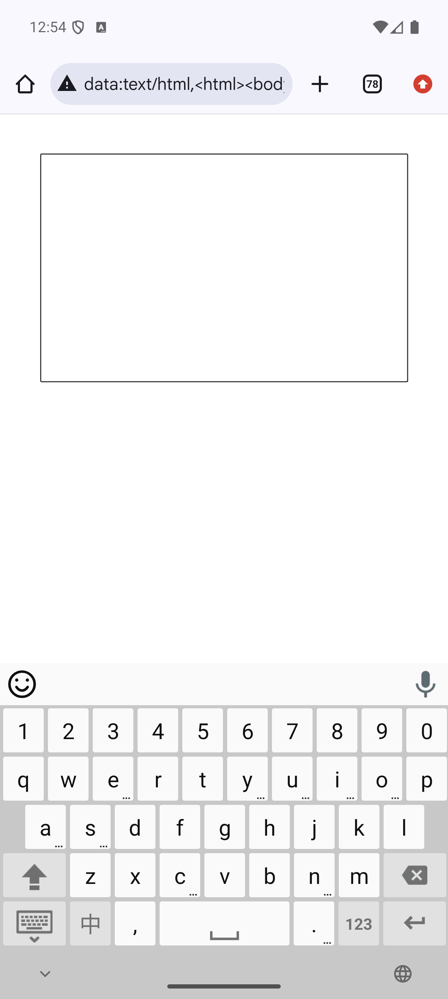 |  |
| Explicit light | 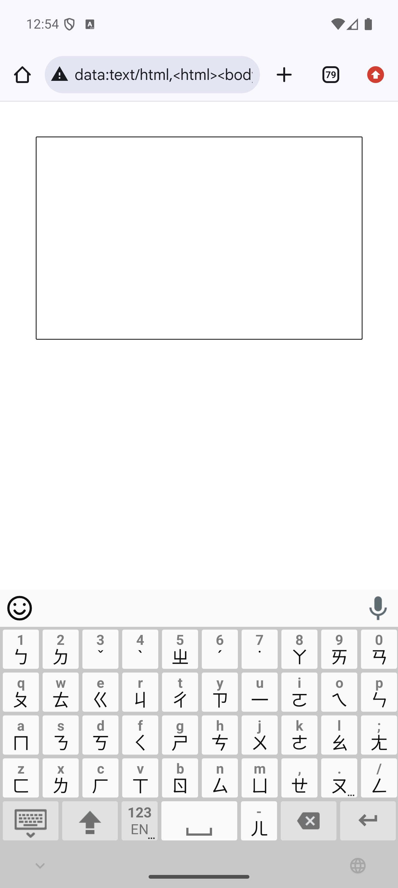 |  | 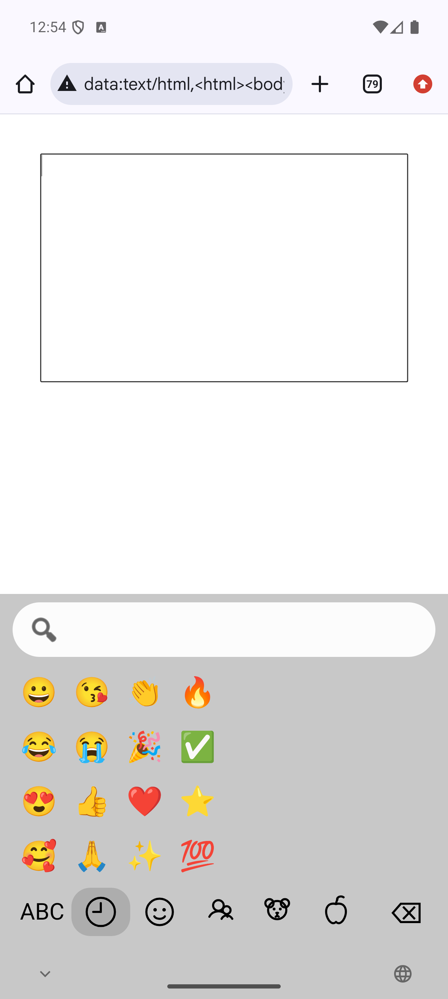 |
| System, system dark |  |  |  |
| Explicit dark | 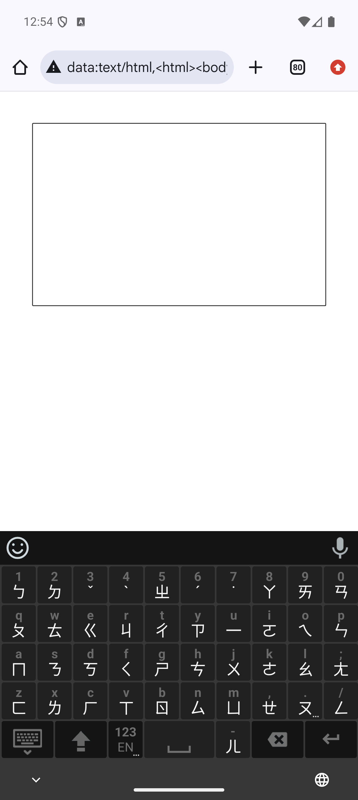 |  | 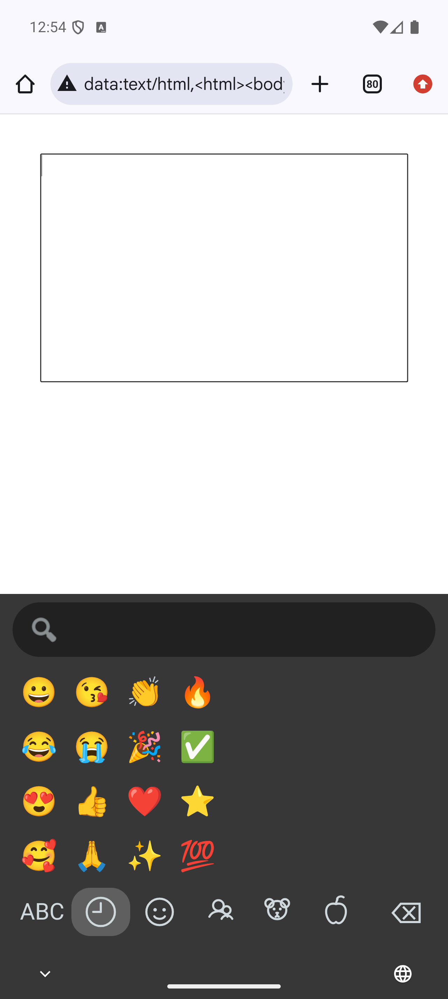 |
| Pink | 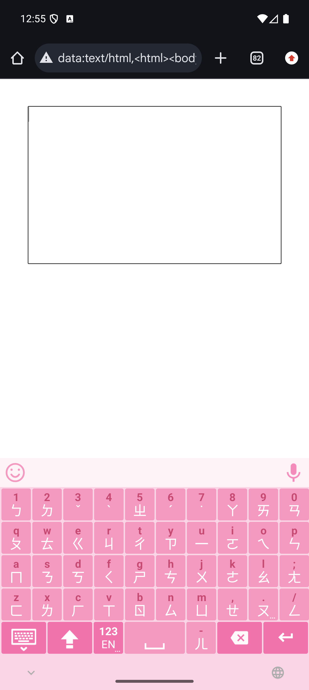 | 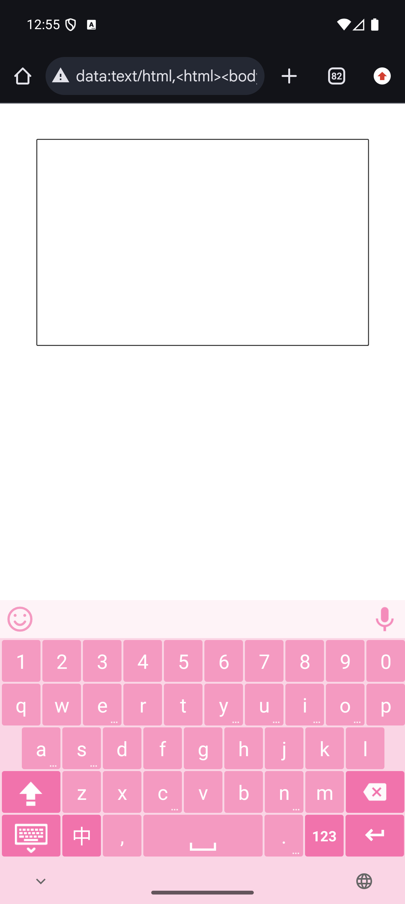 |  |
| Tech Blue |  |  |  |
| Fashion Purple | 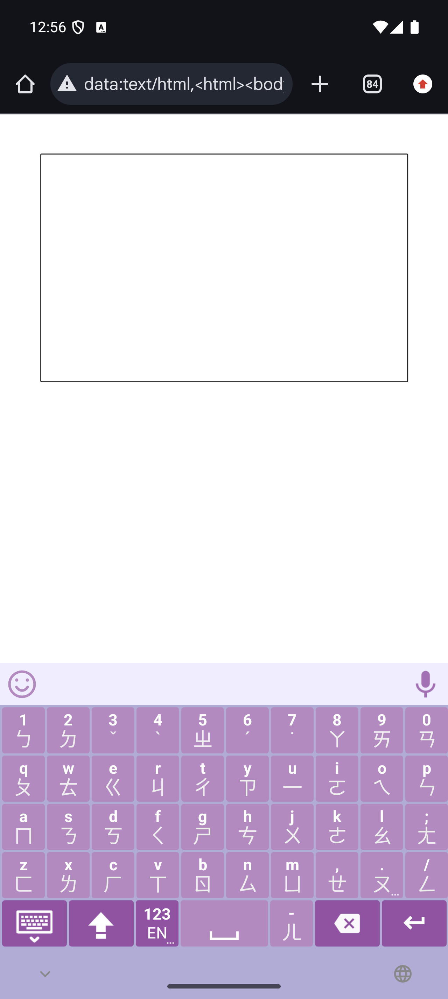 |  | 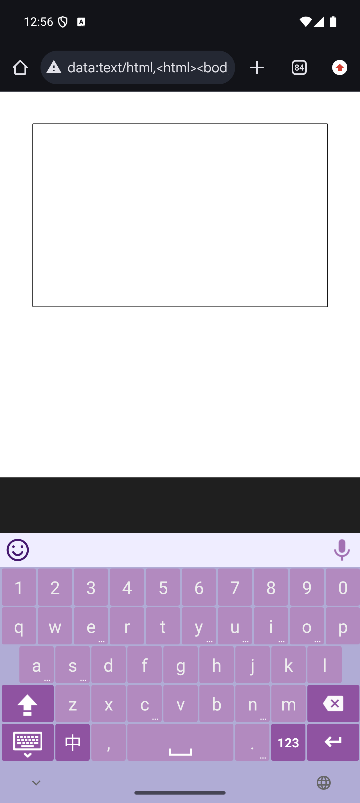 |
| Relax Green | 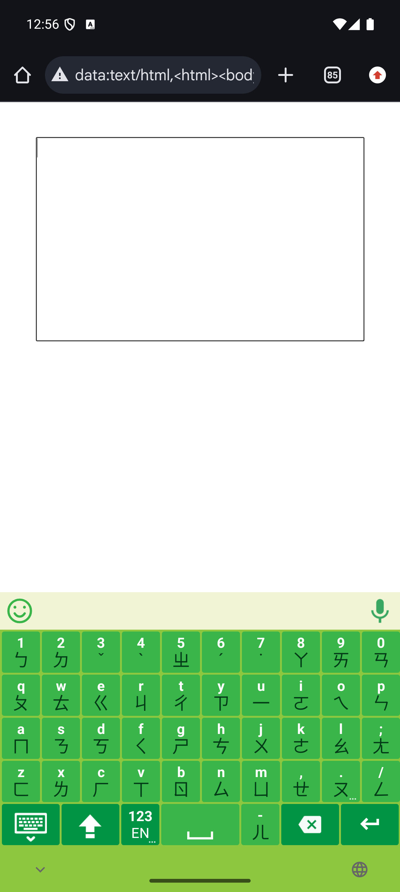 | 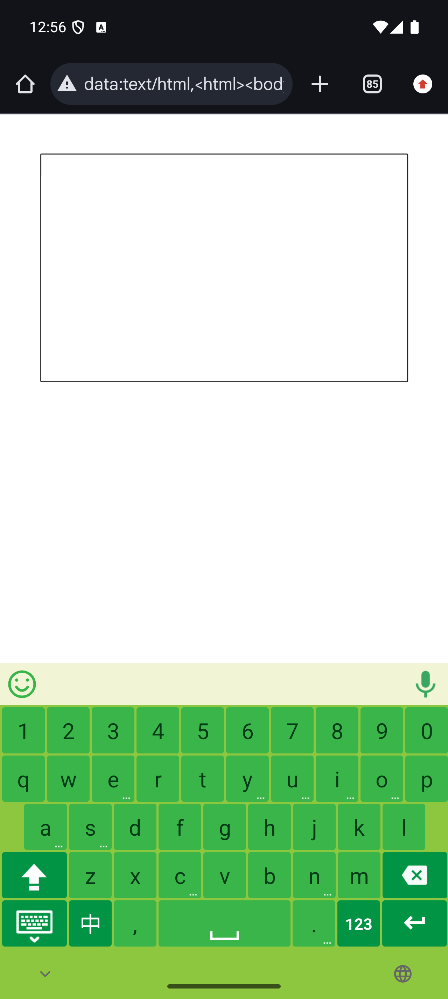 |  |

Do not accept or link a screenshot unless the expected keyboard is visible. For English
keyboard screenshots, the `中` key is the proof that the LIME English layout is active.
For 注音 screenshots, the 注音 key layout and candidate bar are the proof that the
Chinese IM environment is ready. For emoji-panel screenshots, the search field, emoji
grid, and bottom category row are the proof that the panel is active.

## iOS Color Roles

iOS defines the keyboard palettes in `KeyboardPalette`:

| Theme | Background | Normal Key | Modifier Key | Pressed Key | Label | Modifier Label | Secondary Label | Candidate Background | Candidate Text | Candidate Highlight |
|---|---|---|---|---|---|---|---|---|---|---|
| Light | system gray 4, light-resolved | system background, light-resolved | system gray 3, light-resolved | system gray 5, light-resolved | label, light-resolved | label, light-resolved | secondary label, light-resolved | secondary system background, light-resolved | label, light-resolved | system background, light-resolved |
| Dark | system gray 4, dark-resolved | system gray 2, dark-resolved | system gray 4, dark-resolved | system gray, dark-resolved | label, dark-resolved | label, dark-resolved | secondary label, dark-resolved | secondary system background, dark-resolved | label, dark-resolved | system gray 2, dark-resolved |
| Pink | `#FAD5E5` | `#F49AC1` | `#F173AC` | `#F173AC` | `#FFFFFF` | `#FFFFFF` | `#C74A72` | `#FEF3F7` | `#000000` | `#F49AC1` |
| Tech Blue | `#C5DBEC` | `#9BC5E4` | `#6699CC` | `#6699CC` | `#314453` | `#FFFFFF` | `#FFFFFF` | `#D8E7F3` | `#000000` | `#9BC5E4` |
| Fashion Purple | `#B0ACD5` | `#B28ABF` | `#8F53A1` | `#8F53A1` | `#EEEEEE` | `#FFFFFF` | `#FFFFFF` | `#EFEDFF` | `#000000` | `#B28ABF` |
| Relax Green | `#8DC63F` | `#39B54A` | `#009444` | `#009444` | `#003A17` | `#FFFFFF` | `#FFFFFF` | `#F2F5D5` | `#000000` | `#39B54A` |

The iOS palette intentionally mirrors the Android color set for actual key surfaces.
The normal keyboard keys, modifier keys, pressed keys, labels, sublabels, and key
icons should use the resolved `KeyboardPalette`.

## iOS Transparent Background Rule

iOS keyboard extensions do not draw the same full opaque keyboard background model as
Android. The main iOS keyboard view is transparent so the system keyboard blur/backdrop
shows through. Because of that, not every visible keyboard-region element should be
forced to the selected LIME theme palette.

Use this rule:

- Real key surfaces use the selected `KeyboardPalette`.
- UI drawn directly on the transparent/system keyboard backdrop only needs to be
  system light/dark aware.
- Candidate bar text and tools must contrast against the system backdrop, not against
  the selected LIME key theme.
- Emoji panel category icons, emoji labels, search field chrome, and similar panel
  controls may use system semantic colors such as `.label`, `.separator`, `.clear`, and
  default `UISearchTextField` behavior when they draw over the transparent backdrop.

The current candidate bar follows this rule. `KeyboardViewController.applyFeedbackSettings`
computes `adaptedCandiText` from the system interface style before locking other chrome
to the keyboard palette. The iOS emoji launcher icon also follows this rule: it uses the
same SF Symbol glyph (`face.smiling`) for all themes and changes color through
`emojiButton.tintColor = effectiveCandiText`.

This is expected and should not be treated as a theme gap.

## Android Theme-Aware Rule

Android draws its keyboard and emoji panel with concrete views, drawables, and colors.
Visible Android keyboard controls should therefore use the effective keyboard theme
palette unless they are intentionally transparent or debug-only.

For Android, hard-coded white, black, or gray inside the keyboard service is a risk when
the control is visible on themed keyboard surfaces. Prefer one of these sources:

- The active themed style attribute.
- Existing candidate view colors such as candidate background and candidate normal text.
- A small helper derived from the effective keyboard theme.
- Theme-specific resources in `colors.xml` and `styles.xml`.

## Known Good Areas

- Android key backgrounds and key text are style-driven through `LIMEKeyboardBaseView.*`.
- Android candidate bar background/text/icons are style-driven through
  `LIMECandidateView.*`.
- Android candidate-bar emoji launcher icon is theme-aware. Custom-theme normal icons
  use the normal key background color; pressed/focused icons use the theme highlight.
- Android emoji search magnifier is theme-aware. Custom themes use the normal key
  background color for consistency with the emoji launcher and mic affordances.
- iOS key surfaces are palette-driven through `KeyboardPalette`.
- iOS candidate bar and emoji launcher icon are system-backdrop aware by design.
- iOS emoji panel category/search controls are acceptable as system light/dark aware
  because they draw over the transparent keyboard backdrop.

## Resolved Gap: Android Candidate-Bar Emoji Icon Tint

The real-keyboard screenshots exposed a consistency gap outside the emoji panel: the
candidate-bar emoji launcher icon stayed black on custom themes. The fix updates the
normal-state custom emoji launcher vectors to use each theme's normal key background
color:

| Theme | Normal Emoji Launcher Color |
|---|---|
| Pink | `second_background_pink` (`#FFF49AC1`) |
| Tech Blue | `second_background_tech_blue` (`#FF9BC5E4`) |
| Fashion Purple | `second_background_fashion_purple` (`#FFB28ABF`) |
| Relax Green | `second_background_relax_green` (`#FF39B54A`) |

The pressed/focused icon variants continue to use the theme highlight colors. Light and
dark keep their high-contrast neutral icon colors.

## Resolved Gap: Android Emoji Panel Colors

Issue #79 reports that Android dark-mode emoji search stays bright. The source audit
found the broader gap in `LIMEService.java`: the Android emoji panel was built
programmatically and still contained hard-coded light-theme colors.

The fix routes the visible emoji-panel controls through `EmojiPanelColors`, derived from
the effective keyboard theme. The old hard-coded values are now confined to the explicit
light palette branch, where they are intentional.

The emoji search magnifier has its own `searchIcon` palette role. For the four custom
themes, it uses the same normal key background colors as the candidate-bar emoji
launcher so the icon family stays visually consistent:

| Theme | Emoji Search Magnifier Color |
|---|---|
| Pink | `#FFF49AC1` |
| Tech Blue | `#FF9BC5E4` |
| Fashion Purple | `#FFB28ABF` |
| Relax Green | `#FF39B54A` |

Emoji panel density follows the keyboard size preference while keeping the panel's
structure stable:

- The emoji grid always uses 4 rows.
- Emoji cell height and minimum cell width scale with `keyboard_size` for larger tap
  targets.
- Emoji glyph size scales lightly: `base 28 * (1 + (keyboard_size - 1) * 0.5)`.
- Category tabs scale with `keyboard_size` and sit inside a horizontal scroller.
- Category glyphs use the same lightly scaled size as emoji glyphs, so category icons
  do not become visually larger than the emoji grid.
- The emoji panel mode key (`ABC` or `中`) uses the same scaled tab width and height as
  the category controls, but its label is 80% of the category glyph size.
- The emoji panel backspace uses the same scaled tab width, height, and glyph size as
  the category controls.
- Candidate-bar emoji launcher selectors only use the highlight icon while pressed.
  They do not use a persistent focused-state highlight, so Chinese and English keyboard
  screenshots should keep the same normal tint.

Former hard-coded values:

| Area | Current Value | Problem |
|---|---|---|
| Emoji search field background | `0xF2FFFFFF` | Bright white surface in dark keyboard context. |
| Empty search text | `0xFF8A8A8A` | Fixed gray, not guaranteed readable against themed search background. |
| Active search text | `android.R.color.black` | Wrong for dark search surfaces. |
| Search icon | `android.R.drawable.ic_menu_search` with no explicit tint | Likely black/default-tinted and not theme-aware. |
| Emoji cell text | `android.R.color.black` | Wrong if rendered on dark/themed panel surfaces. |
| Category icon paint | `android.R.color.black` | Wrong for dark/themed category row. |
| Active category highlight | `0x22000000` | Fixed black overlay; may be wrong on dark/custom themes. |

## Verification Completed

1. Android system-following light mode was screenshot-verified.
2. Android explicit light and the four custom themes were screenshot-verified.
3. Android system-following dark emoji panel and dark emoji search were screenshot-verified.
4. iOS was policy-reviewed against the transparent background rule: backdrop-drawn
   controls should remain system light/dark aware unless a concrete contrast bug appears.
