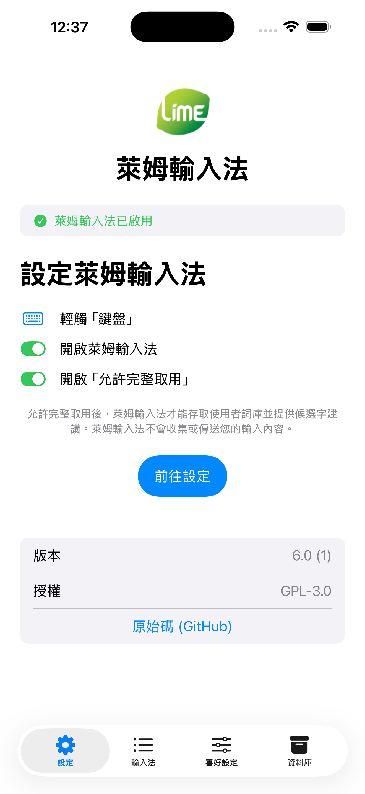
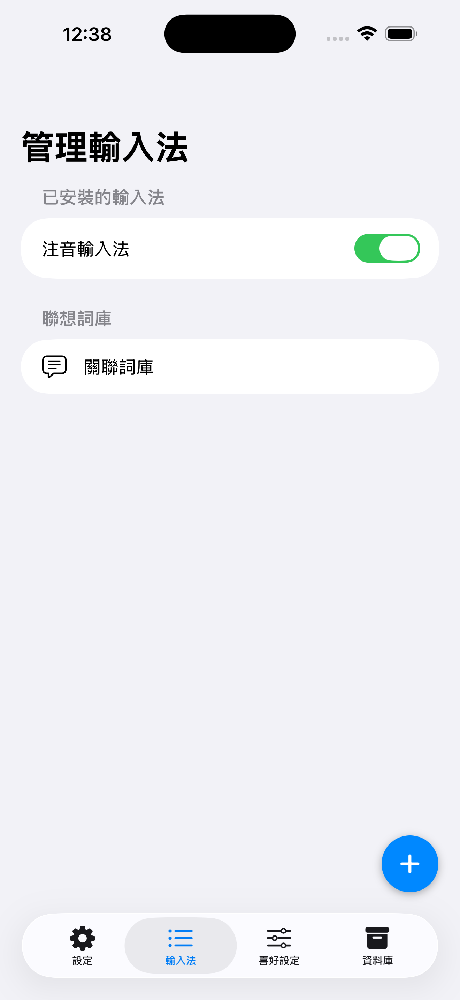
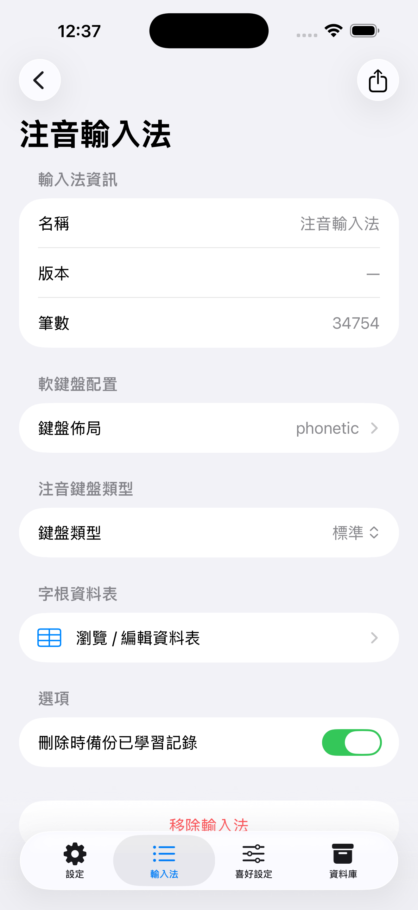
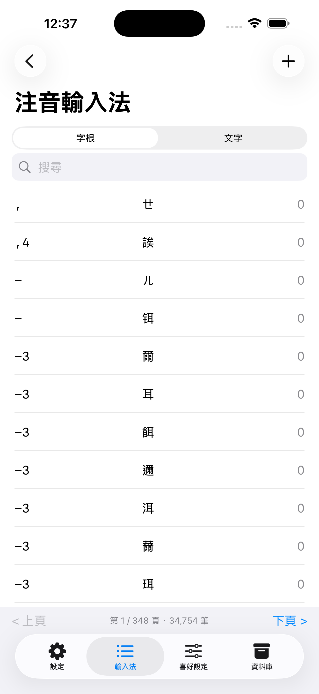
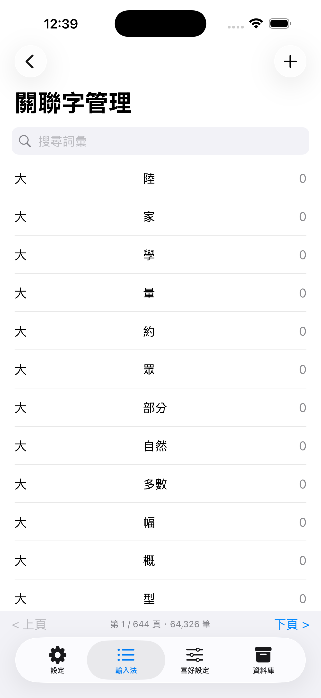
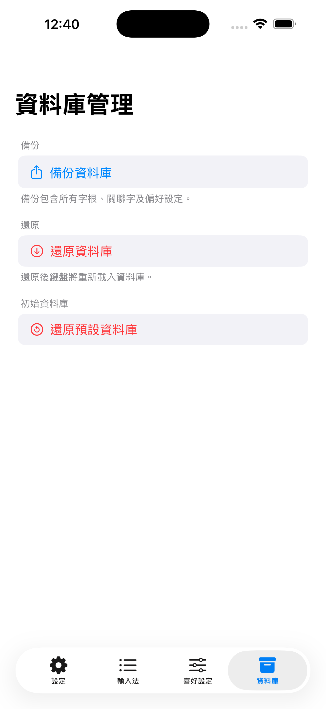
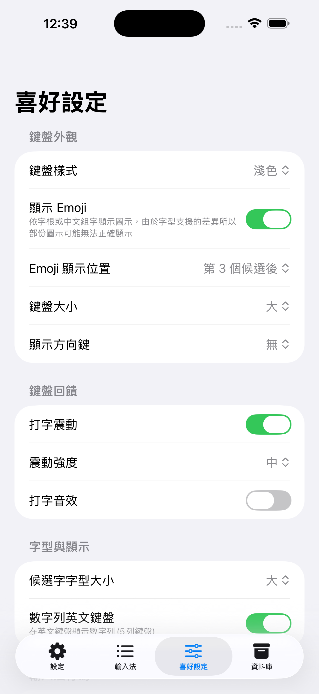
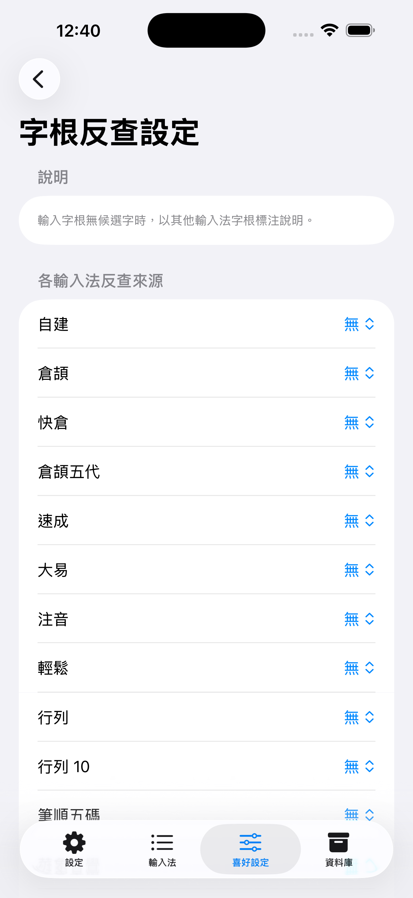

# LIME Settings iOS App — Specification

## 1. Overview

This document specifies the design and behaviour of the **LimeIME container app** (the Settings app the user sees in the iOS Home Screen, not the keyboard extension). The goal is to replicate **every feature of the Android LIME Settings app** while applying iOS HIG conventions: `NavigationStack` / `NavigationView` for drill-down navigation, `Form + Section` for preference settings, `List` with swipe actions for record management, `Picker` for single-choice selections, and `Toggle` for boolean controls.

The app is organized around **four high-level feature areas**:

| Feature | Purpose |
|---|---|
| **IM Manager** | Install, download, import/export, and configure soft keyboard layouts |
| **IM Table Editor** | Browse and edit per-IM character mapping records and related phrases |
| **DB Manager** | Backup and restore the entire database |
| **IM Preferences** | Tune all keyboard behaviour and display settings |

A fifth area — **App Setup** — handles one-time activation and app-level information (version, about).

### Android → iOS Component Mapping

| Android component | iOS Feature Area | Tab |
|---|---|---|
| `SetupImFragment` (activation guide) | App Setup | 設定 |
| `SetupImFragment` (IM buttons) | IM Manager — enable/reorder | 輸入法 |
| `kbsetting.xml` (IM info + keyboard picker) | IM Manager — keyboard config | 輸入法 drill-down |
| `IMStoreView` / cloud download | IM Manager — download | 輸入法 |
| `SetupImFragment` (import file) | IM Manager — import | 輸入法 |
| `ManageImFragment` (record CRUD) | IM Table Editor — mapping records | 輸入法 drill-down |
| `ManageRelatedFragment` | IM Table Editor — related phrases | 輸入法 (drill-down via 關聯字庫) |
| `SetupImFragment` (backup/restore) | DB Manager | 資料庫 |
| `LIMEPreference` (`preference.xml`) | IM Preferences | 喜好設定 |

---

## 2. App Structure

The container app uses a `TabView` with **four tabs**. This collapses the Android navigation drawer + separate Preference activity into a flat tab bar per iOS HIG. Related-phrase editing (formerly a standalone tab) is now accessed via the 關聯字庫 entry inside the 輸入法 tab.

```
TabView
├── [0] 設定       systemImage: "gearshape"          (App Setup)
├── [1] 輸入法      systemImage: "list.bullet"         (IM Manager + IM Table Editor + 關聯字庫)
├── [3] 喜好設定    systemImage: "slider.horizontal.3" (IM Preferences)
└── [4] 資料庫      systemImage: "archivebox"          (DB Manager)
```

Each tab has its own `NavigationStack` (iOS 16+) or `NavigationView` (iOS 15) so drill-down navigation stays scoped to its tab.

---

## 3. MVC Architecture Mandate

The iOS LIME Settings app **strictly follows the same MVC pattern** defined in [UI_ARCHITECTURE.md](UI_ARCHITECTURE.md). This is a hard architectural constraint, not a guideline.

### 3.1 Layer Compliance Rules

| Layer | Android | iOS | Porting Target |
|---|---|---|---|
| **Model** | `SearchServer`, `DBServer`, `LimeDB`, `LIMEPreferenceManager` | Same names, Swift | **100% — identical operations, logic, error handling, threading** |
| **Controller / Manager** | `SetupImController`, `ManageImController`, `NavigationManager`, `ShareManager`, `ProgressManager`, `IntentHandler` | Same names, Swift | **100% — identical orchestration, data flow, callback interfaces** |
| **View** | `MainActivity`, Fragments, Dialogs, `LIMEPreference` Activity | SwiftUI Views, Sheets, `TabView` | **Adapted to iOS HIG only — SwiftUI replaces XML/Fragment, everything else identical** |

### 3.2 Model Layer (100% Port)

The Model layer is ported to Swift with **no behavioural divergence** from the Android source. Every public method, return contract, null-safety rule, and threading assumption must be reproduced exactly.

| Android Class | iOS Swift Class | Purpose |
|---|---|---|
| `SearchServer` | `SearchServer.swift` | DB query operations, record search, keyboard config, related phrase queries |
| `DBServer` | `DBServer.swift` | File-level DB operations — import, export, backup, restore, table ops |
| `LimeDB` | `LimeDB.swift` | SQL abstraction — query execution, schema management, serialization |
| `LIMEPreferenceManager` | `LIMEPreferenceManager.swift` | Preferences persistence, query, defaults — reads/writes the shared App Group suite |

**Model layer rules** (mirroring `UI_ARCHITECTURE.md §Layer 3`):
- No UIKit / SwiftUI framework dependencies (except `FileManager` for file paths).
- No direct reference to any View type.
- Return safe defaults instead of `nil` (empty arrays, zero counts).
- All exceptions caught at this layer; callers receive `Result<T, Error>` or a safe default.

### 3.3 Controller / Handler / Manager Layer (100% Port)

Business logic and operation orchestration are ported to Swift **without changing the operation sequence or callback contract**. The data flow diagrams in `UI_ARCHITECTURE.md §Data Flow` define the exact call order that must be reproduced.

| Android Class | iOS Swift Class | Responsibilities |
|---|---|---|
| `BaseController` | `BaseController.swift` | `@MainActor` UI dispatch, error handling, progress callbacks — mirrors `mainHandler.post()` with Swift `DispatchQueue.main.async` / `await MainActor.run` |
| `SetupImController` | `SetupImController.swift` | Import workflow (txt / limedb / remote download), backup/restore, IM menu refresh, button state |
| `ManageImController` | `ManageImController.swift` | Async record CRUD, related phrase CRUD, search/filter, keyboard selection |
| `NavigationManager` | `NavigationManager.swift` | Tab/screen selection state, navigation callbacks |
| `ShareManager` | `ShareManager.swift` | Export IM / related as `.limedb` or `.lime` text, share-sheet invocation |
| `ProgressManager` | `ProgressManager.swift` | Progress overlay show/update/dismiss — wraps SwiftUI `@Published` state on `@MainActor` |
| `IntentHandler` | `IntentHandler.swift` | Incoming file handling (`.lime`, `.cin`, `.limedb`) from system share / Files |

**Controller layer rules** (mirroring `UI_ARCHITECTURE.md §Layer 2`):
- Controllers receive Model objects via constructor injection — no direct `UserDefaults` or `FileManager` calls except through `DBServer` / `LIMEPreferenceManager`.
- All heavy I/O dispatched on a background `Task` / `DispatchQueue.global`; all View callbacks dispatched on `MainActor`.
- Controllers and Managers hold no UIKit/SwiftUI types — they interact with Views only through **Swift protocols** (see §3.4).

### 3.4 View Protocols (100% Port of Java Interfaces, Swift Syntax)

All Android View interfaces are ported to Swift `protocol` with identical callback signatures.

| Android Interface | Swift Protocol |
|---|---|
| `ViewUpdateListener` | `ViewUpdateListener` |
| `MainActivityView` | `MainActivityView` |
| `SetupImView` | `SetupImView` |
| `ManageImView` | `ManageImView` |
| `ManageRelatedView` | `ManageRelatedView` |
| `NavigationDrawerView` | `NavigationDrawerView` |

```swift
// Direct Swift translation of Android ViewUpdateListener
protocol ViewUpdateListener: AnyObject {
    func onError(_ message: String)
    func onProgress(_ percentage: Int, status: String)
}

protocol SetupImView: ViewUpdateListener {
    func updateButtonStates(_ states: [String: Bool])
    func refreshImList()
}

protocol ManageImView: ViewUpdateListener {
    func displayRecords(_ records: [Record])
    func updateRecordCount(_ count: Int)
    func refreshRecordList()
}

protocol ManageRelatedView: ViewUpdateListener {
    func displayRelatedPhrases(_ phrases: [Related])
    func refreshPhraseList()
}
```

### 3.5 View Layer (iOS-Adapted Only)

The View layer is the **only layer that deviates** from the Android source. Substitutions are one-to-one structural replacements — the same screens exist, only the platform primitives differ.

| Android View Component | iOS Equivalent | Notes |
|---|---|---|
| `MainActivity` (coordinator) | `LimeSettingsApp` + root `ContentView` | Owns and injects controller/manager instances |
| `NavigationDrawerFragment` | `TabView` (§2) | Same IM navigation items, different platform widget |
| `SetupImFragment` | `SetupTabView` + `IMListView` + `IMInstallView` | Setup guide + IM list + download flows |
| `ManageImFragment` | `RecordListView` + `AddRecordView` + `EditRecordView` | Per-IM record CRUD |
| `ManageRelatedFragment` | `RelatedListView(isEmbedded:)` + `AddRelatedView` + `EditRelatedView` | Related phrase CRUD — embedded in IMDetailView via 關聯字庫 entry |
| `LIMEPreference` Activity + `PrefsFragment` | `PreferencesTabView` with `Form` sections | All 11 preference sections |
| `ImportDialog` / `SetupImLoadDialog` | SwiftUI `.sheet` + `.fileImporter` | File selection and import options |
| `ShareDialog` | SwiftUI `.sheet` + `ShareLink` | IM export format selection |
| `ManageImAddDialog` / `ManageImEditDialog` | SwiftUI `.sheet` (`AddRecordView` / `EditRecordView`) | Record add/edit forms |
| `ManageImKeyboardDialog` | `KeyboardPickerView` (Navigation drill-down) | Keyboard layout selection |
| `ProgressDialogManager` overlay | `ProgressManager` `.overlay(ProgressView(...))` | Progress feedback |

**Permitted iOS-View adaptations:**
- Use SwiftUI declarative layout instead of XML inflation.
- Use `NavigationStack` + `TabView` instead of navigation drawer.
- Use `.sheet`, `.alert`, `.confirmationDialog` instead of `AlertDialog` / `DialogFragment`.
- Use `.searchable()` instead of a manual search `EditText` + button.
- Use `@StateObject` / `@ObservedObject` for reactive state instead of `notifyDataSetChanged()`.
- Apply iOS HIG spacing, typography, and colour conventions.

**Not permitted in the View layer:**
- Moving any business logic (DB calls, file I/O, state coordination) directly into a SwiftUI `View` struct — all such logic must remain in the Controller / Manager layer.
- Skipping any screen, operation, or callback defined in the Android source.

### 3.6 Testing and Verification Requirements

The **Model and Controller layers must achieve the same testability goals** as the Android architecture (see `UI_ARCHITECTURE.md §Benefits — Testability`).

| Requirement | Rule |
|---|---|
| **Unit tests for all Controllers** | `SetupImControllerTests`, `ManageImControllerTests` — test every public method with mock Model objects |
| **Unit tests for all Model classes** | `SearchServerTests`, `DBServerTests`, `LimeDBTests`, `LIMEPreferenceManagerTests` |
| **No framework dependency in tests** | Controller and Model tests must compile and run without a simulator (XCTest only, no UIKit/SwiftUI) |
| **Mock View protocols** | Each test file provides a `Mock*View` struct implementing the corresponding protocol to capture callbacks |
| **Data flow verification** | Every data flow in `UI_ARCHITECTURE.md §Data Flow` (import, export, backup, restore) must have a corresponding integration test asserting the full call sequence |
| **Threading verification** | Tests assert that View callbacks are always delivered on the main thread |
| **100% operation coverage** | Every Android operation listed in §3.2 and §3.3 must have a corresponding Swift implementation and a passing test |

---

## 4. Feature: App Setup (設定 Tab) 

**Purpose**: One-time keyboard activation guide, database seeding, and app information. Corresponds to the non-IM-management parts of Android's `SetupImFragment`.

| iOS | Android |
|---|---|
|  |  |

### 4.1 Layout

Inspired by Gboard's setup screen: a single scrollable screen with the LimeIME logo at top, a visual three-step instruction list, and **one CTA button** that opens the app's system Settings page. The navigation bar is hidden; the screen has no title bar.

**iPad / wide-screen layout cap.** The inner `VStack` is wrapped in `.frame(maxWidth: 560).frame(maxWidth: .infinity)` so on iPad the content sits in a centered ~560pt column. On iPhone the cap never engages.

#### iOS (`SetupTabView.swift`)

**Brand block**: `VStack(spacing: 8)` — `appIconUIImage()` reads `CFBundleIcons → CFBundlePrimaryIcon → CFBundleIconFiles` from the bundle (80×80pt, `cornerRadius: 18`); fallback is `Image(systemName: "keyboard.fill")` in an accent-colored tile. Wordmark `Text("萊姆輸入法")` `.largeTitle.bold()` directly below.

**Status banner**: color-coded `Label` in a `secondarySystemBackground` rounded card. See §4.2 for detection logic and exact text. Auto-refreshes on `.onAppear`, `scenePhase → .active`, and 1-second polling `Timer`.

**Setup steps** — three `SetupStepRow` rows (icon 32pt left, label `.body` right):

| Step | Icon | Label |
| --- | --- | --- |
| 1 | `Image(systemName: "keyboard")` `.title3` `.accentColor` | `"輕觸「鍵盤」"` |
| 2 | `ToggleSwitchIcon()` (green capsule + white thumb) | `"開啟萊姆輸入法"` |
| 3 | `ToggleSwitchIcon()` | `"開啟「允許完整取用」"` |
| 4 | `mic` / `keyboard_voice` | `"允許語音輸入"` |

Step 4 is optional and appears only when Android LIME inline dictation is
enabled. It requests Android `RECORD_AUDIO` permission for LIME-owned inline
dictation. Users who skip or deny it still use delegated Google/vendor VoiceIME
fallback, then `RecognizerIntent` fallback.

| Permission state | Color | State text | Explanation below | Button |
|---|---|---|---|---|
| Granted | Green | `萊姆內建語音輸入已啟用 ✓` | `可直接在萊姆鍵盤內使用語音輸入。` | Hidden |
| Not requested / denied but askable | Red | `萊姆內建語音輸入尚未啟用 ✕` | `若要在萊姆鍵盤內直接語音輸入，請允許麥克風權限；也可略過，改用 Google 語音輸入。` | `允許麥克風權限` requests `RECORD_AUDIO` |
| Permanently denied | Yellow | `需至系統設定開啟麥克風權限 ⚠` | `Android 已停止顯示授權視窗。若要使用萊姆內建語音輸入，請前往系統設定，點選「權限」→「麥克風」→「允許」。` | `前往系統設定` opens app info and shows a short toast guide |

**Explanatory note** (`.subheadline`, `.secondary`, centered): `"萊姆輸入法僅需完整取用以啟用按鍵震動回饋。若不需要此功能，可不開啟。萊姆輸入法不會收集或傳送任何個人資料。"`

**CTA**: `Button("前往設定")` `.borderedProminent` `.large` → `openLimeKeyboardSettings()` (§4.1.2).

**Invisible probe field**: 1×1pt `TextField`, opacity 0.01, `accessibilityHidden`. Auto-focused via `@FocusState` when `keyboardEnabled && !fullAccessEnabled`; causes the keyboard extension's `viewWillAppear` to write a fresh `keyboard_has_full_access` to the App Group.

**About section** (`GroupBox` styled as form section): `LabeledContent("版本", value: appVersion())` — `CFBundleShortVersionString (build)`; `LabeledContent("授權", value: "GPL-3.0")`; `Link("原始碼 (GitHub)", destination: githubURL)`.

Full layout structure:

```
NavigationStack (.navigationBarHidden(true))
└── ScrollView
    └── VStack(spacing: 24)
        │
        ├── // ── Brand block ──────────────────────────────────────────
        │   VStack(spacing: 8) {
        │       logoImage              // appIconUIImage() reads CFBundleIcons/CFBundlePrimaryIcon/
        │                             // CFBundleIconFiles from bundle; fallback:
        │                             // Image(systemName: "keyboard.fill") in accent-colored tile
        │           .resizable().scaledToFit()
        │           .frame(width: 80, height: 80)
        │           .clipShape(RoundedRectangle(cornerRadius: 18))
        │       Text("萊姆輸入法")
        │           .font(.largeTitle).bold()
        │   }
        │   .padding(.top, 32)
        │
        ├── // ── Status banner ────────────────────────────────────────
        │   statusBanner              // see §4.2
        │       .padding(.horizontal, 24)
        │
        ├── // ── Setup title ──────────────────────────────────────────
        │   Text("設定萊姆輸入法")
        │       .font(.largeTitle).bold()
        │       .frame(maxWidth: .infinity, alignment: .leading)
        │       .padding(.horizontal, 24)
        │
        ├── // ── Step list ────────────────────────────────────────────
        │   VStack(alignment: .leading, spacing: 16) {
        │       SetupStepRow(text: "輕觸「鍵盤」") {
        │           Image(systemName: "keyboard")
        │               .font(.title3).foregroundColor(.accentColor)
        │       }
        │       SetupStepRow(text: "開啟萊姆輸入法")         { ToggleSwitchIcon() }
        │       SetupStepRow(text: "開啟「允許完整取用」")   { ToggleSwitchIcon() }
        │   }
        │   .padding(.horizontal, 24)
        │
        ├── // ── Explanatory note ─────────────────────────────────────
        │   Text("萊姆輸入法僅需完整取用以啟用按鍵震動回饋。若不需要此功能，可不開啟。萊姆輸入法不會收集或傳送任何個人資料。")
        │       .font(.subheadline).foregroundColor(.secondary)
        │       .multilineTextAlignment(.center)
        │       .padding(.horizontal, 24)
        │
        ├── // ── CTA button ───────────────────────────────────────────
        │   Button("前往設定") { openLimeKeyboardSettings() }
        │       .buttonStyle(.borderedProminent)
        │       .controlSize(.large)
        │       .padding(.horizontal, 24)
        │
        ├── // ── Invisible probe field ────────────────────────────────
        │   TextField("", text: $probeText)   // 1×1 pt, opacity 0.01, accessibilityHidden
        │       .focused($probeFocused)       // auto-focused when keyboard enabled but Full
        │       .frame(width: 1, height: 1)   // Access not confirmed; causes LimeKeyboard's
        │       .opacity(0.01)               // viewWillAppear to write keyboard_has_full_access
        │
        └── // ── About section ────────────────────────────────────────
            GroupBox {
                LabeledContent("版本", value: appVersion())   // CFBundleShortVersionString (build)
                    .padding(.vertical, 11)
                Divider()
                LabeledContent("授權", value: "GPL-3.0")
                    .padding(.vertical, 11)
                Divider()
                Link("原始碼 (GitHub)", destination: githubURL)
                    .padding(.vertical, 11)
            }
            .groupBoxStyle(FormSectionGroupBoxStyle())
            .padding(.horizontal, 24)
            .padding(.bottom, 32)
        // VStack modifiers:
        //   .frame(maxWidth: 560)        // iPad reading-width cap
        //   .frame(maxWidth: .infinity)  // center the column horizontally
```

#### 4.1.1 SetupStepRow

A private generic `@ViewBuilder` helper — icon on the left, label on the right:

```swift
private struct SetupStepRow<Icon: View>: View {
    let text: String
    @ViewBuilder let icon: Icon

    var body: some View {
        HStack(spacing: 16) {
            icon.frame(width: 32, alignment: .center)
            Text(text).font(.body)
            Spacer()
        }
    }
}
```

`ToggleSwitchIcon` is a green `Capsule` + white `Circle` thumb matching the iOS Settings ON-state toggle.

#### 4.1.2 openLimeKeyboardSettings()

Opens the app's own Settings page via `openSettingsURLString`. `App-Prefs:` deep links are intentionally not used — `canOpenURL` returns `true` for whitelisted schemes regardless of path, causing silent navigation to the wrong page.

```swift
private func openLimeKeyboardSettings() {
    if let url = URL(string: UIApplication.openSettingsURLString) {
        UIApplication.shared.open(url)
    }
}
```

#### Android (`fragment_setup.xml` + `SetupImFragment.java`)

Layout: `NestedScrollView` → `LinearLayout`. Brand block is a horizontal row: `ImageView` (logo, 120×120dp) + `TextView("萊姆輸入法")`.

**Status card** (`statusCard`): `MaterialCardView` with `statusIcon` + `statusText` set dynamically by Java based on IME state.

**Three-state machine** (`refreshButtonState()`, driven by `LIMEUtilities.isLIMEEnabled()` / `isLIMEActive()`):

| State | Visible elements |
| --- | --- |
| Not enabled | Heading `"啟動萊姆輸入法"`, description `"萊姆輸入法尚未啟用，請按下一步後，在系統鍵盤輸入法頁面啟用萊姆輸入法。完成後請按返回鍵繼續其他設定。"`, filled button `"下一步"` → `showInputMethodSettingsPage()` |
| Enabled, not active | Description `"萊姆輸入法已啟用但尚未被選用，請按下方按鈕後，在系統鍵盤輸入法選擇頁選用萊姆輸入法。"`, outlined button `"選用萊姆輸入法"` → `showInputMethodPicker()` |
| Enabled and active | Setup heading + buttons hidden; IM list (`SetupImList`) shown |

**About card**: `"版本"` (right-aligned, `version_format` = `"v%1$s - %2$d"`), `"授權"` / `"GPL-3.0"`, `"原始碼"` (right-aligned clickable `txtGithubUrl`).

### 4.2 Status Banner

Re-checks on `.onAppear`, on each `scenePhase → .active` transition, and via a 1-second polling `Timer` while the app is active. The invisible probe field (§4.1) is auto-focused when `keyboardEnabled && !fullAccessEnabled` to trigger the keyboard extension's `viewWillAppear`, which writes a fresh `keyboard_has_full_access` to the App Group.

**Detection logic** (`refreshStatus()`):

- `keyboardEnabled`: `UITextInputMode.activeInputModes` filtered by private `identifier` KVC key matching prefix `"net.toload.limeime"`. Does not use `keyboard_extension_loaded`.
- `fullAccessEnabled`: reads `keyboard_has_full_access` from `UserDefaults(suiteName: "group.net.toload.limeime")`. If the key is absent (extension has never run), assumes `true` to avoid a false-positive orange banner right after first enable.

| State | Color | SF Symbol | Banner text |
| --- | --- | --- | --- |
| `fullyEnabled` | `.green` | `checkmark.circle.fill` | `"萊姆輸入法已啟用"` |
| `enabledNoFullAccess` | `.orange` | `exclamationmark.triangle.fill` | `"鍵盤已啟用，但尚未允許完整取用"` |
| `notEnabled` | `.red` | `xmark.circle.fill` | `"尚未啟用萊姆輸入法鍵盤"` |

Banner renders as `Label(text, systemImage:)` in `.subheadline` font, inside a `secondarySystemBackground` rounded-rect card (`.cornerRadius(10)`).

---

## 5. Feature: IM Manager (輸入法 Tab)

**Purpose**: Install input methods (download from cloud or import local files), configure which IMs are active and in what order, and set each IM's soft keyboard layout. Corresponds to Android's `SetupImFragment` IM grid + `kbsetting.xml` + `IMStoreView`.

### 5.1 IM List Screen

Entry point for the **輸入法** tab.

| iOS | Android |
|---|---|
|  |  |

```
NavigationStack
└── List (editable for drag-reorder)
    ├── Section "已安裝的輸入法"
    │   └── ForEach IMRow  (sorted by im.sortOrder)
    │       ├── HStack
    │       │   ├── Text(im.label).bold  // single line — matches Android sidebar (one line per IM)
    │       │   │   // ImConfig.fullName holds title="name" config entry (Android LIME.IM_FULL_NAME)
    │       │   │   // but iOS importTxtFile never parses @version@ so it is always empty; no subtitle shown
    │       │   └── Toggle("", isOn: $row.enabled)
    │       │       .onChange → db.updateIMEnabled(id:enabled:)
    │       └── NavigationLink → IMDetailView(im: row)
    └── Section "關聯字庫"
        └── NavigationLink "關聯字庫" → IMDetailView(im: synthetic IMRow(tableNick: "related"))
.toolbar {
    ToolbarItem(.navigationBarLeading) { EditButton() }
    ToolbarItem(.navigationBarTrailing) { NavigationLink → IMInstallView  [+ button] }
}
.navigationTitle("管理輸入法")
```

- **Enable / disable**: writes `im.enabled` via `db.updateIMEnabled(id:enabled:)` and updates `keyboard_state` preference string.
- **Drag to reorder**: writes `im.sortOrder` via `db.updateIMSortOrder(id:sortOrder:)`.
- Enabled rows display at full opacity; disabled rows display at half opacity (matching Android's `HALF_ALPHA_VALUE` / italic style).

### 5.2 IM Detail Screen

Drill-down from any IM row **or** from the synthetic 關聯字庫 entry. Shows metadata, allows changing the soft keyboard layout, and links to the Table Editor. Sections are conditionally shown based on `im.tableNick`.

| iOS | Android |
|---|---|
|  |  |

```
NavigationStack (continued)
└── IMDetailView(im: IMRow)
    └── List
        ├── Section "輸入法資訊"  (hidden when im.tableNick == "related")
        │   ├── LabeledContent "名稱"    im.label
        │   ├── LabeledContent "版本"    UserDefaults[tableNick + "mapping_version"] ?? "—"
        │   └── LabeledContent "筆數"    manageImController.countRecords(table: im.tableNick) — fetched in .task
        ├── Section "軟鍵盤配置"  (hidden when im.tableNick == "related")
        │   └── NavigationLink "鍵盤佈局：\(currentKeyboard.name)" → KeyboardPickerView(im:)
        │       (resolved via loadKeyboards; falls back to code string if name unavailable)
        ├── Section "注音鍵盤類型"  (shown only when im.tableNick == "phonetic")
        │   └── Picker "鍵盤類型"  pref: phonetic_keyboard_type  default: "standard"
        │       (see §5.2.2 for the 6 options; onChange writes the `im` table row)
        ├── Section "電話鍵盤設定"  (shown only when im.tableNick == "array10")
        │   └── Picker "自動上屏"  pref: auto_commit  default: 0  — 0=無 4–10=Nth stroke auto-commit
        ├── Section "字根對應設定"  (shown only when im.tableNick == "custom")
        │   ├── Toggle "數字字根對應"  pref: accept_number_index  default: false  — 允許使用數字為輸入法字根
        │   └── Toggle "符號字根對應"  pref: accept_symbol_index  default: false  — 允許使用符號為輸入法字根
        ├── Section "字根資料表"  (header = "關聯字庫" when im.tableNick == "related")
        │   ├── [tableNick != "related"] NavigationLink "瀏覽 / 編輯資料表" → RecordListView(table: im.tableNick)
        │   └── [tableNick == "related"] NavigationLink "瀏覽 / 編輯關聯字庫" → RelatedListView(isEmbedded: true)
        ├── Section "選項"  (hidden when im.tableNick == "related")
        │   └── Toggle "刪除時備份已學習記錄"
        │       pref key: backup_on_delete_{tableNick}  (UserDefaults.standard, per-IM)
        │       default: true
        └── Section (no header)  (hidden when im.tableNick == "related")
            └── Button "移除輸入法" role: .destructive
                → confirmAlert(message varies by toggle state:
                   true:  "此操作將清除「…」的所有對應資料。\n已學習記錄將先備份，可在重新匯入時還原。確定繼續？"
                   false: "此操作將清除「…」的所有對應資料，無法還原。確定繼續？")
                → manageImController.clearTable(tableNick:, backupLearning: backupOnDelete)
                   ├── [if backupLearning] SearchServer.backupUserRecords(tableNick)
                   ├── SearchServer.clearTable → LimeDB.clearTable (DELETE records + resetImConfig)
                   ├── LIMEPreferenceManager.syncIMActivatedState (rebuilds keyboard_state)
                   ├── markKeyboardCacheDirty
                   └── invalidate (triggers IMListView reload)
                → dismiss IMDetailView; onRefresh()
```

**Synthetic 關聯字庫 row**: `IMRow(id: -1, imName: "related", label: "關聯字庫", tableNick: "related", ...)` — constructed inline in `IMListView`; `.task` skips keyboard loading for this row.

**Share / Export** (toolbar `square.and.arrow.up` button, all rows including 關聯字庫):
- Tapping opens a `confirmationDialog` with format choices.
- Non-related IMs: `.lime（文字）` → `SetupImController.exportIMAsText` → `DBServer.exportTxtTable`; `.limedb（資料庫）` → `exportIMAsLimedb` → `DBServer.exportZippedDb`.
- 關聯字庫: only `.limedb` → `exportRelatedAsLimedb` → `DBServer.exportZippedDbRelated`.
- A `ProgressView` overlay shows during export; on success, `ShareSheet` (UIActivityViewController) is presented.

> `keyboard_list` (last-used IM) is **not** cleared after remove — mirrors Android behaviour.
> The keyboard extension will naturally find no candidates if the cleared IM is still active.

> The "字根對應設定" section is exclusive to the custom IM (`im.tableNick == "custom"`). All built-in IMs hardcode their own `hasNumberMapping` / `hasSymbolMapping` values in `initializeIMKeyboard()` and ignore these prefs.

> The "注音鍵盤類型" section is exclusive to the phonetic IM (`im.tableNick == "phonetic"`). It lives on the IM detail page (not the global 喜好設定 tab) because `phonetic_keyboard_type` only affects the phonetic IM — both the DB-level letter-to-bopomofo remap and the visible keyboard layout. See §5.2.2 for details.

#### 5.2.1 KeyboardPickerView — Soft Keyboard Selection

Equivalent to Android's `ManageImKeyboardDialog`.

```
NavigationStack (continued)
└── KeyboardPickerView
    └── List
        └── ForEach keyboards (from loadKeyboards; filtered to !isDisabled)
            └── HStack { Text(kb.name), Spacer(),
                        Image(systemName: "checkmark").hidden(!isSelected) }
               .onTapGesture → manageImController.setKeyboard(forIM:keyboard:); dismiss
               selectedCode seeded from im.keyboardId so checkmark shows immediately
.navigationTitle("選擇鍵盤佈局")
```

- Selection is persisted via `db.setIMKeyboard(table:description:code:)`.
- For the **注音** IM specifically, changing the layout here must also update the `phonetic_keyboard_type` preference so the keyboard extension picks up the correct layout.

#### 5.2.2 注音鍵盤類型 (Phonetic Keyboard Type)

Shown only when `im.tableNick == "phonetic"`. A single `Picker` bound to the `phonetic_keyboard_type` preference.

| UI Control | Pref Key | Type | Default | Notes |
|---|---|---|---|---|
| `Picker` "鍵盤類型" | `phonetic_keyboard_type` | String | `"standard"` | See options below |

**Phonetic keyboard type options**:

| Value | Display Label |
|---|---|
| `standard` | 標準 |
| `et_41` | 倚天 41 鍵 |
| `eten26` | 倚天 26 鍵 (英文鍵盤) |
| `eten26_symbol` | 倚天 26 鍵 (符號鍵盤) |
| `hsu` | 許氏 (英文鍵盤) |
| `hsu_symbol` | 許氏 (符號鍵盤) |

**Live update**: when this picker value changes, call `DBServer.setImConfigKeyboard("phonetic", kb)` to update the `im` table immediately (mirrors Android's `onSharedPreferenceChanged` in `LIMEPreference`). Use SwiftUI's `.onChange(of: phoneticKeyboardType)`:

```swift
.onChange(of: phoneticKeyboardType) { newType in
    updatePhoneticKeyboard(type: newType)   // writes im table
}
```

The keyboard extension re-reads both the pref and the DB row at the top of `initOnStartInput()` via `refreshPhoneticKeyboardPrefs()`, so the visible layout and the DB-level remap update on the next keyboard show — no extension restart required.

### 5.3 IM Install Screen — Download & Import

Entry point reachable from the "下載 / 匯入輸入法" NavigationLink in §5.1. Each IM is a top-level `DisclosureGroup`; cloud download options appear only for built-in IMs.

| iOS | Android |
|---|---|
|  |  |

```
NavigationStack (continued)
└── IMInstallView
    └── List
        ├── DisclosureGroup "注音"
        │   ├── [if checkBackupTable("phonetic")]
        │   │   Toggle "還原已學習記錄"
        │   │   pref key: restore_on_import_phonetic  (UserDefaults.standard)
        │   │   default: true (when first shown)
        │   ├── Button "☁ OpenVanilla 注音字根"          → downloadIM(CLOUD_PHONETIC,                 table: "phonetic", restoreLearning: restoreOnImport)
        │   ├── Button "☁ OpenVanilla 注音字根 (BIG5字集)" → downloadIM(CLOUD_PHONETIC_BIG5,          table: "phonetic", restoreLearning: restoreOnImport)
        │   ├── Button "☁ 注音連打字根"                  → downloadIM(CLOUD_PHONETIC_COMPLETE,        table: "phonetic", restoreLearning: restoreOnImport)
        │   ├── Button "☁ 注音連打字根 (BIG5字集)"       → downloadIM(CLOUD_PHONETIC_COMPLETE_BIG5,   table: "phonetic", restoreLearning: restoreOnImport)
        │   ├── Button "匯入 .limedb"     → fileImporter → importFromAttachedDB(table: "phonetic", restoreLearning: restoreOnImport)
        │   └── Button "匯入 .cin / .lime"  → fileImporter → importTxtTable(table: "phonetic", restoreLearning: restoreOnImport)
        │   (同上模式適用於以下所有 built-in IM DisclosureGroup，各 IM 獨立使用 restore_on_import_{tableNick} key；
        │    checkBackupTable 返回 false 時 Toggle 不顯示；關聯字庫 group 除外)
        ├── DisclosureGroup "倉頡"
        │   ├── [if checkBackupTable("cj")] Toggle "還原已學習記錄"  pref: restore_on_import_cj  default: true
        │   ├── Button "☁ 倉頡字根"           → downloadIM(CLOUD_CJ,      table: "cj", restoreLearning: restoreOnImport)
        │   ├── Button "☁ 倉頡字根 (BIG5字集)" → downloadIM(CLOUD_CJ_BIG5, table: "cj", restoreLearning: restoreOnImport)
        │   ├── Button "☁ 倉頡香港字字根"     → downloadIM(CLOUD_CJHK,    table: "cj", restoreLearning: restoreOnImport)
        │   ├── Button "匯入 .limedb"         → fileImporter → importFromAttachedDB(table: "cj", restoreLearning: restoreOnImport)
        │   └── Button "匯入 .cin / .lime"      → fileImporter → importTxtTable(table: "cj", restoreLearning: restoreOnImport)
        ├── DisclosureGroup "倉頡五代"
        │   ├── Button "☁ 倉頡五代字根"       → downloadIM(CLOUD_CJ5, table: "cj5")
        │   ├── Button "匯入 .limedb"         → fileImporter → importFromAttachedDB(table: "cj5")
        │   └── Button "匯入 .cin / .lime"      → fileImporter → importTxtTable(table: "cj5")
        ├── DisclosureGroup "快倉"
        │   ├── Button "☁ 快倉字根"           → downloadIM(CLOUD_SCJ, table: "scj")
        │   ├── Button "匯入 .limedb"         → fileImporter → importFromAttachedDB(table: "scj")
        │   └── Button "匯入 .cin / .lime"      → fileImporter → importTxtTable(table: "scj")
        ├── DisclosureGroup "速成"
        │   ├── Button "☁ 簡易速成"           → downloadIM(CLOUD_ECJ,   table: "ecj")
        │   ├── Button "☁ 速成香港字字根"     → downloadIM(CLOUD_ECJHK, table: "ecj")
        │   ├── Button "匯入 .limedb"         → fileImporter → importFromAttachedDB(table: "ecj")
        │   └── Button "匯入 .cin / .lime"      → fileImporter → importTxtTable(table: "ecj")
        ├── DisclosureGroup "大易"
        │   ├── Button "☁ OpenVanilla 大易字根"  → downloadIM(CLOUD_DAYI,      table: "dayi")
        │   ├── Button "☁ Unicode 3+4 碼單字版" → downloadIM(CLOUD_DAYIUNI,   table: "dayi")
        │   ├── Button "☁ Unicode 3+4 碼詞庫版" → downloadIM(CLOUD_DAYIUNIP,  table: "dayi")
        │   ├── Button "匯入 .limedb"           → fileImporter → importFromAttachedDB(table: "dayi")
        │   └── Button "匯入 .cin / .lime"        → fileImporter → importTxtTable(table: "dayi")
        ├── DisclosureGroup "輕鬆"
        │   ├── Button "☁ 輕鬆字根"             → downloadIM(CLOUD_EZ, table: "ez")
        │   ├── Button "匯入 .limedb"           → fileImporter → importFromAttachedDB(table: "ez")
        │   └── Button "匯入 .cin / .lime"        → fileImporter → importTxtTable(table: "ez")
        ├── DisclosureGroup "行列"
        │   ├── Button "☁ 老刀行列字根"         → downloadIM(CLOUD_ARRAY, table: "array")
        │   ├── Button "匯入 .limedb"           → fileImporter → importFromAttachedDB(table: "array")
        │   └── Button "匯入 .cin / .lime"        → fileImporter → importTxtTable(table: "array")
        ├── DisclosureGroup "行列 10"
        │   ├── Button "☁ 老刀行列10字根"       → downloadIM(CLOUD_ARRAY10, table: "array10")
        │   ├── Button "匯入 .limedb"           → fileImporter → importFromAttachedDB(table: "array10")
        │   └── Button "匯入 .cin / .lime"        → fileImporter → importTxtTable(table: "array10")
        ├── DisclosureGroup "拼音"
        │   ├── Button "☁ 拼音字根"             → downloadIM(CLOUD_PINYIN,    table: "pinyin")
        │   ├── Button "☁ 拼音字根 (簡體GB)"    → downloadIM(CLOUD_PINYINGB,  table: "pinyin")
        │   ├── Button "匯入 .limedb"           → fileImporter → importFromAttachedDB(table: "pinyin")
        │   └── Button "匯入 .cin / .lime"        → fileImporter → importTxtTable(table: "pinyin")
        ├── DisclosureGroup "華象直覺"
        │   ├── Button "☁ 華象完整版"           → downloadIM(CLOUD_HS,    table: "hs")
        │   ├── Button "☁ 華象一版"             → downloadIM(CLOUD_HS_V1, table: "hs")
        │   ├── Button "☁ 華象二版"             → downloadIM(CLOUD_HS_V2, table: "hs")
        │   ├── Button "☁ 華象三版"             → downloadIM(CLOUD_HS_V3, table: "hs")
        │   ├── Button "匯入 .limedb"           → fileImporter → importFromAttachedDB(table: "hs")
        │   └── Button "匯入 .cin / .lime"        → fileImporter → importTxtTable(table: "hs")
        ├── DisclosureGroup "筆順五碼"
        │   ├── Button "☁ 筆順五碼字根"         → downloadIM(CLOUD_WB, table: "wb")
        │   ├── Button "匯入 .limedb"           → fileImporter → importFromAttachedDB(table: "wb")
        │   └── Button "匯入 .cin / .lime"        → fileImporter → importTxtTable(table: "wb")
        ├── DisclosureGroup "自建"
        │   ├── Button "匯入 .limedb"     → fileImporter → importFromAttachedDB(table: "custom") → seedCustomIM()
        │   └── Button "匯入 .cin / .lime"  → fileImporter → importTxtTable(table: "custom") → seedCustomIM()
        ├── DisclosureGroup "關聯字庫"  systemImage: "text.bubble"
        │   └── Button "匯入 .limedb"     → fileImporter → DBServer.importDbRelated(sourcedb:) → manageRelatedController.invalidate()
        └── Section "狀態"  (visible only when statusMessage is non-empty)
            └── Text(statusMessage).font(.footnote).foregroundColor(.secondary)
```

#### 5.3.1 Progress Overlay

When import or download is running, show a centred `ProgressView("匯入中…")` overlay with the current status message. Set `.interactiveDismissDisabled(true)` on any surrounding sheet.

#### 5.3.2 Download Behaviour

1. Download `.zip` or `.limedb` to `FileManager.default.temporaryDirectory`.
2. If `.zip`, extract with `ZipArchive` or the `Zip` SPM library.
3. Route by file extension:
   - `.cin` / `.lime` → `db.importTxtFile(at:tableName:progress:)`, streaming progress updates.
   - `.db` / `.limedb` → `db.importFromAttachedDB(sourcePath:tableName:)`.
4. After import, call `db.seedDefaultIMs()` (or an explicit `insertImConfig`) so the IM appears in the list.
5. Clean up the temp file.

#### 5.3.3 Local File Import

- **Named IM rows**: `tableName` is fixed to the IM code shown in the `DisclosureGroup` header.
- **自建 (custom) row**: same pipelines with `tableName = "custom"`. After import, call `db.seedCustomIM()` to upsert `(code: "custom", title: "自建", keyboard: "lime_cj")` into the `im` table.
- After any import, reload the IM list in §5.1.

---

## 6. Feature: IM Table Editor

**Purpose**: Browse, search, and perform CRUD on the character mapping records of each installed IM (`mapping` tables) and on the cross-IM related-phrase pairs (`related` table). Corresponds to Android's `ManageImFragment` and `ManageRelatedFragment`.

### 6.1 Mapping Record List — RecordListView

Reached via NavigationLink from §5.2 ("瀏覽 / 編輯資料表").

| iOS | Android |
|---|---|
|  |  |

```
NavigationStack (continued)
└── RecordListView(table: String)
    ├── .searchable(text: $query, prompt: "搜尋")
    ├── Picker "" segmented: ["字根", "文字"]   // search-by selector
    ├── List
    │   └── ForEach records (page of 100)
    │       ├── HStack
    │       │   ├── Text(record.code).monospaced
    │       │   ├── Spacer()
    │       │   ├── Text(record.word)
    │       │   └── Text("\(record.score)").secondary.caption
    │       └── .swipeActions(edge: .trailing) {
    │           Button("刪除", role: .destructive) → confirmAlert → db.removeRecord
    │           Button("編輯")                     → sheet: EditRecordView
    │       }
    └── HStack "pagination bar" {
        Button("‹ 上頁")   .disabled(page == 0)
        Spacer()
        Text("第 \(page+1) 頁 / 共 \(totalRecords) 筆")
        Spacer()
        Button("下頁 ›")   .disabled(isLastPage)
    }
.toolbar {
    ToolbarItem(placement: .navigationBarTrailing) {
        Button(systemImage: "plus") → sheet: AddRecordView
    }
}
.navigationTitle(im.label)
```

**Pagination**: 100 records per page (Android `LIME.IM_MANAGE_DISPLAY_AMOUNT`). Changing page or query resets to page 0.

**Search modes**:
- **字根**: prefix match on `code` column.
- **文字**: contains match on `word` column.

#### 6.1.1 AddRecordView (sheet) — Equivalent to `ManageImAddDialog`

```
Form
├── Section "新增資料列"
│   ├── TextField "字根 (code)"
│   ├── TextField "文字 (word)"
│   └── ScoreInputRow "分數"
│       ├── Button(systemImage: "minus.circle") → score = max(0, score - 1)
│       ├── TextField(value: score, keyboard: numberPad, width: 64)
│       └── Button(systemImage: "plus.circle")  → score = min(9999, score + 1)
└── Section
    └── Button "確認新增" → guard !code.isEmpty && !word.isEmpty
                          → db.addRecord(table:code:word:score:)
                          → dismiss
```

Android `ManageImAddSheet` must expose the same row-editor content:
`取消` framed button, title/subtitle `新增資料列`, fields `字根` and `文字`,
score row with `-`, directly editable numeric score, and `+`, then a framed
rectangular `確認新增` action. The bottom sheet remains scrollable and IME-aware
per issue #65.

#### 6.1.2 EditRecordView (sheet) — Equivalent to `ManageImEditDialog`

```
Form
├── Section "編輯資料列"
│   ├── TextField "字根"  binding: code
│   ├── TextField "文字"  binding: word
│   └── ScoreInputRow "分數"       // same editable score control as AddRecordView
├── Section
│   └── Button("儲存") → confirmAlert → db.updateRecord(id:code:score:word:) → dismiss
└── Section
    └── Button("刪除", role: .destructive) → confirmAlert → db.removeRecord(id:) → dismiss
```

Validation on Save: code and word must not be empty.

Android `ManageImEditSheet` mirrors the same content with title/subtitle
`編輯資料列`, prefilled `字根`/`文字`, directly editable numeric score, framed
rectangular `刪除`, and framed rectangular `儲存`.

### 6.2 Related Phrase List — RelatedListView (embedded in §5.2)

The related-phrase editor is reached via **輸入法 → 關聯字庫 → 瀏覽 / 編輯關聯字庫**. It is no longer a standalone tab. `RelatedListView` accepts `isEmbedded: Bool`; when `true` the inner `NavigationView` wrapper is omitted so it can be pushed as a navigation destination without nesting. Equivalent to Android's `ManageRelatedFragment`.

| iOS | Android |
|---|---|
|  |  |

```
NavigationStack (continued from §5.2)
└── RelatedListView(isEmbedded: true)
    ├── .searchable(text: $query, prompt: "搜尋詞彙")
    ├── List
    │   └── ForEach relatedList (page of 100)
    │       ├── HStack { Text(r.word).bold, Spacer(), Text(r.related).secondary }
    │       └── .swipeActions(edge: .trailing) {
    │           Button("刪除", role: .destructive) → confirmAlert → db.removeRelated
    │           Button("編輯")                     → sheet: EditRelatedView
    │       }
    └── HStack "pagination bar"  (same pattern as §6.1)
.toolbar {
    ToolbarItem(placement: .navigationBarTrailing) {
        Button(systemImage: "plus") → sheet: AddRelatedView
    }
}
.navigationTitle("關聯字管理")
```

**Pagination**: 100 per page; search resets to page 0.

**Search**: prefix / contains match on `word` column.

#### 6.2.1 AddRelatedView (sheet) — Equivalent to `ManageRelatedAddDialog`

```
Form
├── Section "新增資料列"
│   ├── TextField "詞彙 (word)"
│   ├── TextField "關聯字 (related)"
│   └── ScoreInputRow "分數"
│       ├── Button(systemImage: "minus.circle") → score = max(0, score - 1)
│       ├── TextField(value: score, keyboard: numberPad, width: 64)
│       └── Button(systemImage: "plus.circle")  → score = min(9999, score + 1)
└── Section
    └── Button("確認新增") → guard both non-empty
                         → db.addRelated(word:related:score:)
                         → dismiss
```

The score is persisted to the `related.score` value on add. Default score is
`0`; both platforms must accept direct numeric entry and clamp values to
`0...9999`.

#### 6.2.2 EditRelatedView (sheet) — Equivalent to `ManageRelatedEditDialog`

```
Form
├── Section "編輯資料列"
│   ├── TextField "詞彙"    binding: word
│   ├── TextField "關聯字"  binding: related
│   └── ScoreInputRow "分數"       // initialized from existing related score
├── Section
│   └── Button("儲存", role .none)        → confirmAlert
│                                        → db.updateRelated(word:related:score:)
│                                        → dismiss
└── Section
    └── Button("刪除", role: .destructive) → confirmAlert → db.removeRelated → dismiss
```

The score field must update the persisted related-row score and the list score
shown in `RelatedListView` / `ManageRelatedFragment`.

### 6.3 Cross-platform Add/Edit Row Editor Contract

This contract applies to all four row-editor sheets:

- IM add: `AddRecordView` / `ManageImAddSheet`
- IM edit: `EditRecordView` / `ManageImEditSheet`
- Related add: `AddRelatedView` / `ManageRelatedAddSheet`
- Related edit: `EditRelatedView` / `ManageRelatedEditSheet`

Required structure:

```
RowEditorSheet
├── Cancel action: "取消"
├── Title: "新增資料列" or "編輯資料列"
├── Subtitle: same as title
├── Field group
│   ├── IM:      "字根"/"文字"
│   └── Related: "詞彙"/"關聯字"
├── Score row
│   ├── Label "分數"
│   ├── decrement button "-"
│   ├── directly editable numeric field
│   └── increment button "+"
└── Actions
    ├── Add:  framed "確認新增"
    └── Edit: framed "儲存" and destructive framed "刪除"
```

Platform styling requirements:

- iOS uses `Form` sheet styling and SF Symbol score buttons.
- Android uses the #65 full-height, scrollable, IME-aware bottom sheet.
- Android action buttons must keep the existing rectangular Material outline
  vocabulary; do not use pill-shaped save/cancel buttons.
- Score `-` / `+` controls may remain circular/icon-like on both platforms.
- Score is editable by direct typing as well as by the `-` / `+` controls.

Visual verification evidence:

| State | iOS | Android |
|---|---|---|
| Related add |  |  |
| Related edit |  |  |

---

## 7. Feature: DB Manager (資料庫 Tab)

**Purpose**: Backup the entire `lime.db` file and restore from a previous backup. Corresponds to the backup/restore buttons in Android's `SetupImFragment`.

| iOS | Android |
|---|---|
|  |  |

### 7.1 Layout

No second-level navigation exists in this tab, so it uses a `ScrollView` + `VStack` layout
(same pattern as the 設定 tab) rather than `List`. This gives a centred 560 pt column on iPad
and a standard full-width layout on iPhone.

```
NavigationStack
└── ScrollView
    └── VStack(alignment: .leading, spacing: 0)   // .padding(.horizontal, 24)
        │                                           // .frame(maxWidth: 560)
        │                                           // .frame(maxWidth: .infinity)
        │
        ├── [iPad only] Text("資料庫管理")           // .font(.title2).bold()
        │   // Nav bar hidden on iPad (.navigationBarHidden(hSize == .regular))
        │   // so the title is rendered here, left-aligned with the content column.
        │   // On iPhone the standard navigation large title is used instead.
        │
        ├── formSection(header: "備份", footer: "備份包含所有字根、關聯字及喜好設定。")
        │   └── Button "備份資料庫"  systemImage: "square.and.arrow.up"
        │       → performBackup() → UIActivityViewController (Files, AirDrop, Mail…)
        │
        ├── formSection(header: "還原", footer: "還原後鍵盤將重新載入資料庫。")
        │   └── Button "還原資料庫"  systemImage: "arrow.down.circle"  .foregroundColor(.red)
        │       → confirmAlert("還原後目前所有資料將被取代，確定繼續？")
        │       → fileImporter([.item])   // pick .db / .limedb
        │       → performRestore(from:)
        │
        ├── formSection(header: "初始資料庫")
        │   └── Button "還原預設資料庫"  systemImage: "arrow.counterclockwise.circle"  .foregroundColor(.red)
        │       → confirmAlert → restoreBundledDatabase()
        │
        └── [if statusMessage non-empty] formSection(header: "狀態")
            └── Text(statusMessage).font(.footnote).foregroundColor(.secondary)
    .background(Color(UIColor.systemGroupedBackground).ignoresSafeArea())
    .navigationTitle("資料庫管理")          // iPhone only (nav bar shown)
    .navigationBarHidden(hSize == .regular) // hide nav bar on iPad; show on iPhone
```

`formSection(header:footer:content:)` is a private `@ViewBuilder` helper that renders a
`GroupBox` styled with `FormSectionGroupBoxStyle` (shared with `SetupTabView`) with a small
uppercase header label above and an optional footnote footer below, matching the visual
language of an `.insetGrouped` List section.

**iPad width cap.** The inner `VStack` carries `.frame(maxWidth: 560).frame(maxWidth: .infinity)`
so the content sits in a centred column. The navigation bar is hidden on iPad and a custom
`.title2.bold()` title is shown at the top of the column (left-aligned with the GroupBoxes)
at the same vertical height as the large navigation titles in the IM Manager and Preferences
tabs. On iPhone the standard navigation large title is used and the custom title is hidden.

### 7.2 Backup Behaviour

1. Call `DBServer.shared.backupDatabase(uri: tempZip, progress:)` from a `Task.detached(priority: .userInitiated)`. The call is dispatched off the main actor — calling it via `MainActor.run` would block SwiftUI from rendering the progress overlay until the work finished. `DBServer` is a plain class (not `@MainActor`-isolated) and GRDB serializes the queue internally, so background dispatch is safe.
2. `backupDatabase` zips `lime.db` (+ journal + filtered shared-prefs plist) into a temp `.zip` and accepts an optional `Progress` for ZIPFoundation to update during `addEntry`. The view observes `progress.fractionCompleted` via KVO and republishes to a `@State backupProgress: Double`.
3. After `closeDatabase()` (required to checkpoint GRDB's WAL into the main file), the `defer` block **must** rebuild the datasource: `datasource = try? LimeDB(path: livePath)`. `LimeDB.openDBConnection()` is a no-op stub on iOS, so without the explicit rebuild every later `dbQueue.write` throws SQLITE_MISUSE 21 ("out of memory" in `sqlite3_errmsg`), the IM list silently empties (`tableHasData` swallows the error via `try?`), and reinstall fails with the same error. Mirror the pattern used by `restoreDatabase()`.
4. Present via `ShareLink(item: URL(fileURLWithPath: tempZip))` (SwiftUI) or `UIActivityViewController` (UIKit bridge) so the user can save to Files, send via AirDrop, etc.
5. Clean up temp file after the share sheet is dismissed.

### 7.3 Restore Behaviour

1. Show a **confirmation alert** before proceeding: "還原後目前所有資料將被取代，確定繼續？".
2. On confirm, open a `.fileImporter` restricted to `.item` (to pick `.db` / `.limedb` files).
3. On file selection:
   a. Stop any in-flight DB access (notify keyboard extension via App Group flag if needed).
   b. Copy the picked file over `lime.db` in the App Group container.
   c. Re-open the DB connection and verify integrity.
   d. Reload the IM list in §5.1 and the related list in §6.2.
4. Show status: "✅ 資料庫還原完成" or "❌ 還原失敗：\(error)".

### 7.4 Progress Overlay

When backup, restore, or initial-DB restore is running, show a centred modal overlay (dimmed background + rounded card). The overlay is gated by `isWorking` and renders one of three states:

- **Generic** (`backupProgress == 0 && !preparingShare`): `ProgressView("處理中…")`. Used by the restore / restore-bundled paths or before the first ZIPFoundation callback fires on the backup path.
- **Determinate** (`backupProgress > 0 && !preparingShare`): `Text("備份中… \(Int(backupProgress * 100))%")` above a `ProgressView(value: backupProgress)` (180 pt wide). Used during the zip phase of `backupDatabase` once ZIPFoundation starts reporting `fractionCompleted`. Required for large databases (e.g. 50 MB+ after many learned words) where the zip step is multi-second and a spinner alone reads as a freeze.
- **Preparing share** (`preparingShare == true`): `ProgressView("準備備份中…")`. Bridges the gap between the zip finishing and the `UIActivityViewController` actually presenting. `UIActivityViewController(activityItems: [url])` does synchronous main-thread work (file-type sniffing, preview generation, activity discovery, etc.) that can block for several seconds on a multi-MB backup zip — without this phase the user sees a frozen screen with no spinner between "備份中… 100%" and the share sheet finally appearing.

State transitions:

1. Tap `備份資料庫` → `isWorking = true`, `backupProgress = 0`, `preparingShare = false` → overlay shows generic `處理中…` while the detached task is queued.
2. ZIPFoundation `Progress.fractionCompleted` KVO fires → `Task { @MainActor in backupProgress = value }` → overlay flips to determinate `備份中… N%`.
3. `backupDatabase` returns successfully → on `MainActor`: `backupProgress = 0`, `preparingShare = true`, `showShareSheet = true`. `isWorking` is **not** cleared here. Overlay flips to `準備備份中…` and stays visible during the synchronous `UIActivityViewController` init.
4. Share sheet finishes presenting (it draws over the overlay). User saves / cancels.
5. `.sheet(onDismiss:)` clears `isWorking`, `backupProgress`, `preparingShare` and removes the temp zip via `cleanupBackup()`.

Error branch: catch sets `isWorking = false`, `preparingShare = false`, `backupProgress = 0`, and writes the error to `statusMessage`.

**Why the preparing-share phase exists.** Verified on WJIP17 (iPhone 17 Pro): with a real-sized `lime.db` (post-learning, multi-MB), the dominant cost is *not* the zip — it is the `UIActivityViewController` initialization that runs synchronously on the main thread when SwiftUI presents `.sheet(isPresented: $showShareSheet)`. Tapping `備份資料庫` previously flashed the determinate bar for a fraction of a second and then locked the DB Manager view for ~20 seconds with no spinner until the share sheet eventually drew. Keeping `isWorking = true` and pivoting the overlay text to `準備備份中…` covers the whole window so the user always sees feedback. Do not move the `isWorking = false` / `preparingShare = false` resets back into the `MainActor.run` block that follows `try server.backupDatabase(...)` — that re-introduces the freeze.

---

## 8. Feature: IM Preferences (喜好設定 Tab)

**Purpose**: Replicate all settings from Android's `LIMEPreference` (`preference.xml`). All values persist to `UserDefaults(suiteName: "group.net.toload.limeime")` so the keyboard extension can read them without IPC.

**Title**: The IM Preferences root screen title is always `喜好設定` on both platforms. This applies to the iOS tab/navigation title, the Android settings tab toolbar title, and the standalone Android `LIMEPreference` Activity launched from the keyboard long-press menu. Do not use an app-level settings title or old keyboard-preferences wording for this screen.

| iOS | Android |
|---|---|
|  |  |

Use `@AppStorage(key, store: UserDefaults(suiteName: "group.net.toload.limeime"))` (aliased as `sharedDefaults` constant) for every value.

### 8.1 Section 鍵盤外觀 (Keyboard Appearance)

| UI Control | Pref Key | Type | Default | Values / Notes |
|---|---|---|---|---|
| `Picker` "鍵盤樣式" | `keyboard_theme` | Int | 6 | 0=淺色 1=深色 2=粉紅 3=科技藍 4=時尚紫 5=放鬆綠 6=系統設定 |
| `Picker` "鍵盤大小" | `keyboard_size` | String | "1" | "1.2"=特大 "1.1"=大 "1"=一般 "0.9"=小 "0.8"=特小 |
| `Picker` "候選字字型大小" | `font_size` | String | "1" | Scale string, same values as `keyboard_size`; also exposed as raw `candidateFontSize` Double (14–28 pt) |
| `Toggle` "數字列英文鍵盤" | `number_row_in_english` | Bool | true | 在英文鍵盤顯示數字列(5列鍵盤); **iPhone only** — hidden on iPad (`PreferencesTabView.swift` gates with `userInterfaceIdiom != .pad`) |
| `Picker` "顯示方向鍵" | `show_arrow_key` | Int | 0 | 0=無 1=鍵盤上方 2=鍵盤下方 |
| `Picker` "分離鍵盤" | `split_keyboard_mode` | Int | 0 | 0=關閉 1=開啟 2=僅橫向; **iPad only** — hide on iPhone |

> The keyboard extension reads `keyboard_theme` at `viewDidLoad`.
> - Values **0–5**: fixed colour themes regardless of system appearance. 0=淺色, 1=深色, 2=粉紅, 3=科技藍, 4=時尚紫, 5=放鬆綠.
> - Value **6**: follows the system Light/Dark appearance (`UITraitCollection.current.userInterfaceStyle` on iOS; `Configuration.UI_MODE_NIGHT_MASK` on Android). When the system switches between light and dark the keyboard re-renders accordingly.

### 8.2 Section 鍵盤回饋 (Keyboard Feedback)

| UI Control | Pref Key | Type | Default | Values / Notes |
|---|---|---|---|---|
| `Toggle` "打字震動" | `vibrate_on_keypress` | Bool | true | |
| `Picker` "震動強度" | `vibrate_level` | Int | 40 | 10=特弱 20=弱 40=中 60=強 80=特強; maps to `UIImpactFeedbackGenerator`: 10–20→`.light`, 40→`.medium`, 60–80→`.heavy` |
| `Toggle` "打字音效" | `sound_on_keypress` | Bool | false | |

> Unlike Android API 31+ (which hides `vibrate_level`), iOS must keep this Picker because `UIImpactFeedbackGenerator` intensity is caller-controlled.

### 8.4 Section 輸入法行為 (IM Behaviour)

| UI Control | Pref Key | Type | Default | Values / Notes |
|---|---|---|---|---|
| `Toggle` "智慧組詞" | `smart_chinese_input` | Bool | true | 部份輸入法可能會影響中英混打功能. |
| `Toggle` "自動中文標點" | `auto_chinese_symbol` | Bool | false | 無候選字詞時顯示中文標點選項. |
| `Toggle` "滑動選取候選字" | `candidate_switch` | Bool | true | 開啟：跟手滑動 關閉：滑動翻頁 |
| `Toggle` "記憶中英模式" | `persistent_language_mode` | Bool | false | 下次切換前保持中英模式. |
| `Picker` "Emoji 顯示位置" | `enable_emoji_position` | Int | 6 | 0=不顯示 Emoji 候選字; 2–10=position after Nth candidate |
| `NavigationLink` "字根反查設定" | `reverse_lookup_screen` | Screen | n/a | Opens §8.4.1. Last item in §8.4. |

#### 8.4.1 字根反查設定 — Sub-screen

A `NavigationLink` "字根反查設定" appears as the last row inside §8.4 and opens a dedicated sub-screen. Configures which IM provides the reverse-lookup annotation for each main IM when no candidate is found. The `none` option disables the popup for that IM.

| iOS | Android |
|---|---|
|  |  |

```
NavigationLink "字根反查設定" → ReverseLookupSettingsView
```

```
ReverseLookupSettingsView
└── Form
    ├── Section "說明"
    │   └── Text "輸入字根無候選字時，以其他輸入法字根標注說明。"
    └── Section "各輸入法反查來源"
        └── ForEach enabled IMs from the IM list tab path
            └── Picker "<IM list display name>" pref: <table>_im_reverselookup style: .menu
```

All pickers default to `"none"`. Picker rows are dynamic: iOS loads the same enabled IM list used by the IM list tab (`ManageImController.loadIMList()`), preserving that tab's order and display-name fallback. Picker choices are also dynamic: `none` displays as `無`, followed by the same enabled IM display names. Picker tags / stored values remain the table codes (`cj`, `phonetic`, `dayi`, etc.), so existing preferences and reverse-lookup DB logic remain compatible. If the source-choice list is unavailable, the picker choices may fall back to the built-in IM code list, but the visible rows do not fall back to all IMs.

### 8.5 Section 漢字轉換 (Han Conversion)

| UI Control | Pref Key | Type | Default | Notes |
|---|---|---|---|---|
| `Picker` "簡繁轉換" (`.segmented`) | `han_convert_option` | Int | 0 | 0=不轉換 1=繁→簡 2=簡→繁 |

### 8.6 Section 關聯字與學習 (Related Phrases & Learning)

| UI Control | Pref Key | Type | Default | Notes |
|---|---|---|---|---|
| `Toggle` "啟用關聯字庫" | `similiar_enable` | Bool | true | 啟用關聯字庫功能 |
| `Picker` "建議字顯示數量" | `similiar_list` | Int | 20 | Options: 0 / 10 / 20 / 30 / 40 / 50 |
| `Toggle` "自動學習關聯字" | `candidate_suggestion` | Bool | true | 依輸入文字自動建立關聯字 |
| `Toggle` "自動學習新詞" | `learn_phrase` | Bool | true | 從常用關聯字學習新詞 |
| `Toggle` "啟動選取排序" | `learning_switch` | Bool | true | 依選取次數排序選字清單 |

### 8.7 Section 英文字典 (English Dictionary)

| UI Control | Pref Key | Type | Default | Notes |
|---|---|---|---|---|
| `Toggle` "啟用英文建議字" | `english_dictionary_enable` | Bool | true | 當使用英文輸入模式時，顯示英文建議字 |

> `accept_number_index` and `accept_symbol_index` are surfaced in §5.2 `IMDetailView` under the "字根對應設定" section, shown only when the custom IM is active (`im.tableNick == "custom"`). They are omitted from §8 because all built-in IMs hardcode their own number/symbol mapping behaviour.

> `auto_commit` is surfaced in §5.2 `IMDetailView` under the "電話鍵盤設定" section, shown only when `im.tableNick == "array10"`. It is IM-specific because it only applies to array10's phone-numpad keyboard layout. Android incorrectly also fires for phonetic (substring match bug); iOS uses `activeIM == "array10"` (correct intent).

---

## 9. Preference Key Reference

All stored in `UserDefaults(suiteName: "group.net.toload.limeime")`.

| Pref Key | Android Key | Type | Default |
|---|---|---|---|
| `keyboard_theme` | `keyboard_theme` | Int | 6 |
| `enable_emoji_position` | `enable_emoji_position` | Int | 6 |
| `keyboard_size` | `keyboard_size` | String | "1" |
| `font_size` | `font_size` | String | "1" |
| `candidateFontSize` | *(derived)* | Double | 18 |
| `show_arrow_key` | `show_arrow_key` | Int | 0 |
| `split_keyboard_mode` | `split_keyboard_mode` | Int | 0 |
| `vibrate_on_keypress` | `vibrate_on_keypress` | Bool | true |
| `vibrate_level` | `vibrate_level` | Int | 40 |
| `sound_on_keypress` | `sound_on_keypress` | Bool | false |
| `number_row_in_english` | `number_row_in_english` | Bool | true |
| `smart_chinese_input` | `smart_chinese_input` | Bool | true |
| `auto_chinese_symbol` | `auto_chinese_symbol` | Bool | false |
| `auto_commit` | `auto_commit` | Int | 0 *(array10 IMDetailView only)* |
| `phonetic_keyboard_type` | `phonetic_keyboard_type` | String | "standard" |
| `han_convert_option` | `han_convert_option` | Int | 0 |
| `custom_im_reverselookup` | `custom_im_reverselookup` | String | "none" |
| `cj_im_reverselookup` | `cj_im_reverselookup` | String | "none" |
| `scj_im_reverselookup` | `scj_im_reverselookup` | String | "none" |
| `cj5_im_reverselookup` | `cj5_im_reverselookup` | String | "none" |
| `ecj_im_reverselookup` | `ecj_im_reverselookup` | String | "none" |
| `dayi_im_reverselookup` | `dayi_im_reverselookup` | String | "none" |
| `bpmf_im_reverselookup` | `bpmf_im_reverselookup` | String | "none" |
| `ez_im_reverselookup` | `ez_im_reverselookup` | String | "none" |
| `array_im_reverselookup` | `array_im_reverselookup` | String | "none" |
| `array10_im_reverselookup` | `array10_im_reverselookup` | String | "none" |
| `wb_im_reverselookup` | `wb_im_reverselookup` | String | "none" |
| `hs_im_reverselookup` | `hs_im_reverselookup` | String | "none" |
| `pinyin_im_reverselookup` | `pinyin_im_reverselookup` | String | "none" |
| `similiar_list` | `similiar_list` | Int | 20 |
| `similiar_enable` | `similiar_enable` | Bool | true |
| `candidate_switch` | `candidate_switch` | Bool | true |
| `candidate_suggestion` | `candidate_suggestion` | Bool | true |
| `learn_phrase` | `learn_phrase` | Bool | true |
| `learning_switch` | `learning_switch` | Bool | true |
| `english_dictionary_enable` | `english_dictionary_enable` | Bool | true |
| `accept_number_index` | `accept_number_index` | Bool | false |
| `accept_symbol_index` | `accept_symbol_index` | Bool | false |
| `persistent_language_mode` | `persistent_language_mode` | Bool | false |
| `keyboard_state` | `keyboard_state` | String | "0;1;2;3;…;12" |
| `keyboard_list` (active IM) | `keyboard_list` | String | "phonetic" |
| `language_mode` | `language_mode` | String | `"no"` *(internal storage state; "yes"=English-only, "no"=Chinese; written by `setLanguageMode` when `persistent_language_mode` is on; not user-toggleable)* |
| `auto_cap` | `auto_cap` | Bool | `true` *(shadow accessor per §10.1; iOS reads `textDocumentProxy.autocapitalizationType` directly — no UI, no callers)* |

**Per-IM backup/restore preference keys** (stored in `UserDefaults.standard`, NOT the App Group — keyboard extension does not read them):

| Pref Key | Android Key | Type | Default | Notes |
|---|---|---|---|---|
| `backup_on_delete_{tableNick}` | *(new)* | Bool | `true` | Per-IM. Controls whether learned records are backed up before `clearTable`. Shown in IMDetailView §5.2. |
| `restore_on_import_{tableNick}` | *(new)* | Bool | `true` | Per-IM. Controls whether backed-up records are restored after import/download. Shown in IMInstallView §5.3. |

---

## 10. iOS Adaptation Notes

### 10.1 Features Not Applicable on iOS

| Android Feature | Reason | iOS Decision |
|---|---|---|
| Entire 外接鍵盤 (External Keyboard) section | iOS does not allow 3rd-party keyboard extensions to intercept physical/Bluetooth keyboard input | **Omit entire section** |
| Google Drive backup | Not available on iOS | **Omit**; use Files / iCloud Drive via `ShareLink` instead |
| `vibrate_level` hidden on Android API 31+ | iOS `UIImpactFeedbackGenerator` is caller-controlled | **Keep as Picker** with intensity mapping |
| System notification bar during DB load | Keyboard extensions cannot post system notifications | **Use in-app `ProgressView` overlay** |
| Android navigation drawer | Platform-specific pattern | **Use `TabView`** + `NavigationStack` |
| `BroadcastReceiver` for IME change | iOS has no equivalent broadcast | **Poll in `scenePhase` `.active` transition** |
| `auto_cap` (首字自動大寫) | iOS provides `textDocumentProxy.autocapitalizationType` per text field — no user toggle needed | **Omit**; keyboard extension reads `autocapitalizationType` directly |

### 10.2 iOS-Only Enhancements

| Feature | Notes |
|---|---|
| Three-state status banner | Real-time green / yellow / red detection on scene activation |
| Split keyboard (iPad-only) | `split_keyboard_mode` row hidden on `UIDevice.current.userInterfaceIdiom == .phone` |
| `ShareLink` backup | Native share sheet for `.db` output |
| `@AppStorage(store:)` | Shared suite ensures keyboard extension reads prefs without IPC |
| `UIImpactFeedbackGenerator` | Maps `vibrate_level` → `.light / .medium / .heavy` style |

### 10.3 Shared UserDefaults

- **Always** use `UserDefaults(suiteName: "group.net.toload.limeime")` — never `UserDefaults.standard`.
- **Never** use `@AppStorage` without the explicit `store:` parameter.
- Preferences are **not** synced via iCloud (`NSUbiquitousKeyValueStore`); that is a future opt-in.

**Exception — LimeSettings-only keys**: `backup_on_delete_{tableNick}` and `restore_on_import_{tableNick}` intentionally use `UserDefaults.standard` (not the App Group suite). These are UI-only preferences read exclusively by LimeSettings; the keyboard extension never reads them. Using `UserDefaults.standard` avoids polluting the shared App Group namespace with host-app-only state.

### 10.4 `keyboard_state` Synchronisation

Android stores enabled IM indices as a semicolon-delimited string (`"0;1;2;…"`). On iOS the canonical state is `im.enabled` in the DB, but `keyboard_state` must still be written whenever the user toggles an IM so `KeyboardViewController` can read it the same way. Port `LIMEPreferenceManager.syncIMActivatedState()` to call from the IM list toggle handler.

---

## 11. Data Persistence and Threading

### 11.1 Database Access

- All DB reads and writes must run on a **background thread** (`DispatchQueue.global(qos: .userInitiated)` or `Task { await … }` with an actor).
- All UI state mutations must occur on the **main thread** (`DispatchQueue.main.async` or `@MainActor`).

### 11.2 DB Open Guard

Every database-touching function should guard on a successful open:

```swift
guard let db = openDB() else {
    errorMessage = "無法開啟資料庫"
    return
}
```

### 11.3 Pagination Constants

| Constant | Value | Used in |
|---|---|---|
| Records per page | 100 | RecordListView (§6.1), RelatedListView (§6.2) |
| `similiar_list` default | 20 | Related-word candidate count (§8.6) |
| `similiar_list` options | 0 / 10 / 20 / 30 / 40 / 50 | Picker in §8.6 |

---

## 12. Feature Parity Checklist

### App Setup (§4)
- [ ] Step-by-step keyboard activation guide
- [ ] Real-time keyboard-enabled status banner (green / yellow / red)
- [ ] Full Access detection
- [ ] "前往系統設定" deep-link button
- [ ] Optional `RECORD_AUDIO` setup step for LIME inline dictation, hidden when
      inline dictation is disabled; denial falls back to Google/vendor VoiceIME
- [ ] Bundled IM seeding button (`seedDefaultIMs`)
- [ ] App version, licence, GitHub link

### IM Manager — IM List (§5.1)
- [ ] List of installed IMs with enable/disable toggle
- [ ] Toggle persists to `im.enabled` and updates `keyboard_state` preference
- [ ] Drag-to-reorder persists to `im.sortOrder`
- [ ] Enabled / disabled visual distinction (full / half opacity)

### IM Manager — IM Detail & Soft Keyboard (§5.2)
- [ ] IM info: source, version, record count, status
- [ ] Keyboard layout picker (`KeyboardPickerView`)
- [ ] `phonetic_keyboard_type` live update on keyboard change
- [x] "字根對應設定" section with `accept_number_index` / `accept_symbol_index` toggles (shown only when `im.tableNick == "custom"`) — **§13.3 done**

### IM Manager — Download & Import (§5.3)
- [ ] Per-IM `DisclosureGroup` list: 注音, 倉頡, 快倉, 倉頡五代, 速成, 大易, 輕鬆, 行列, 行列 10, 拼音, 華象直覺, 筆順五碼, 自建
- [ ] Cloud download buttons (☁) for each built-in IM; none for 自建
- [ ] `Button "匯入 .limedb"` + `Button "匯入 .cin / .lime"` for every IM row; all named-IM rows use fixed `tableName`
- [x] Each DisclosureGroup contains cloud variant rows + `Button "匯入 .limedb"` + `Button "匯入 .cin / .lime"` with fixed `tableName = family.id` — **§13.3 done**
- [x] 自建 group (no cloud variants) appended to catalog; import calls `seedCustomIM()` after — **§13.3 done**
- [ ] Progress overlay during import / download
- [ ] Status message on completion

### IM Table Editor — Mapping Records (§6.1)
- [ ] Paginated record list (100/page) with pagination bar
- [ ] Search by code (prefix)
- [ ] Search by word (contains)
- [ ] Add record (code + word + score stepper)
- [ ] Edit record (code, word, +/- score)
- [ ] Delete record (swipe action + confirmation)

### IM Table Editor — Related Phrases (§6.2)
- [ ] Paginated related-phrase list (100/page)
- [ ] Search by word
- [ ] Add related phrase (word → related)
- [ ] Edit related phrase
- [ ] Delete related phrase (swipe + confirmation)

### DB Manager (§7)
- [ ] Backup database via share sheet (Files, AirDrop, …)
- [ ] Restore database from file picker (with confirmation alert)
- [ ] Progress overlay during backup / restore

### IM Preferences (§8)
- **Keyboard Appearance** (§8.1): `keyboard_theme` (values 0–5 + **6=系統設定** on both platforms — **§13.2 done**), `keyboard_size`, `font_size`, `number_row_in_english` (iPhone-only), `show_arrow_key`, `split_keyboard_mode` (iPad)
- **Feedback** (§8.2): `vibrate_on_keypress`, `vibrate_level`, `sound_on_keypress`
- **IM Behaviour** (§8.4): `smart_chinese_input`, `auto_chinese_symbol`, `candidate_switch`, `persistent_language_mode`, `enable_emoji_position`, `reverse_lookup_screen`
- **Array10 detail page** (§5.2): `auto_commit`
- **Phonetic IM detail page** (§5.2.2): `phonetic_keyboard_type` (6 options) with live IM table update
- **Han Conversion** (§8.5): `han_convert_option`
- **Learning** (§8.6): `similiar_enable`, `similiar_list`, `candidate_suggestion`, `learn_phrase`, `learning_switch`
- **English Dictionary** (§8.7): `english_dictionary_enable`
- ~~**External Keyboard**: removed — iOS does not allow 3rd-party extensions to intercept physical keyboard input~~ — **§13.1 done**
- **Reverse Lookup sub-screen** (§8.4.1): Drill-in from §8.4 with per-IM picker rows; each picker shows `無` plus the enabled IM display names while storing table-code values.

---

## 13. TODO

### 13.1 Remove Physical Keyboard Dead Code

iOS does not allow 3rd-party keyboard extensions to intercept physical/Bluetooth keyboard input. The following must be removed:

- `PreferencesTabView.swift`: `@AppStorage` properties `englishDictPhysical`, `hideSwKbWithPhysical`, `physicalKbSort`, `switchEnglishMode`, `switchEnglishModeShift`, `disablePhysicalSelkey` (lines ~53–60) and the entire "外接鍵盤" `Section` block that renders them (lines ~206–216); also remove the `Toggle` "外接鍵盤英文建議字" from the English Dictionary section (line ~206).
- `LIMEPreferenceManager.swift`: properties `disablePhysicalSelkey`, `physicalKeyboardType`, `englishDictPhysicalKeyboard`, `hideSwKbTypingWithPhysical`, `physicalKeyboardSort`, `switchEnglishMode`, `switchEnglishModeShift` (and their getters/setters).
- `LIMEPreferenceManagerTest.swift`: tests `testDefaultSwitchEnglishMode`, `testDefaultSwitchEnglishModeShift`, `testDefaultDisablePhysicalSelkey`.
- `SearchServerTest.swift`: `test_3_3_5_12_updateScoreCache_physical_keyboard_sort_preference` (currently skipped, can be deleted).

### 13.2 Implement `keyboard_theme` Value 6 (系統設定)

Spec §8.1 adds value `6=系統設定` on both platforms. The following code changes are required:

- `PreferencesTabView.swift`: Add `6` to the `keyboard_theme` Picker with label "系統設定".
- `KeyboardViewController.swift` (or the theme-application helper): In the function that applies `keyboard_theme`, add a `case 6` branch that reads `UITraitCollection.current.userInterfaceStyle` and maps `.light` → theme 0 (淺色) and `.dark` → theme 1 (深色). Also override `traitCollectionDidChange(_:)` (or use `registerForTraitChanges` on iOS 17+) so the keyboard re-applies the theme automatically when the system appearance changes at runtime.
- `LIMEPreferenceManager.swift`: Update the `getKeyboardTheme()` getter's documentation comment to note that value `6` is valid; callers in the keyboard extension must handle it.
- `LIMEPreferenceManagerTest.swift`: Add `testKeyboardThemeSystemValue()` asserting default is `6` and that setting `6` round-trips correctly.

### 13.3 Implement Custom IM (自建輸入法) Support

Android has a "匯入自建輸入法" button in `SetupImFragment` (`btnSetupCustom` / `btnImportCustom` in `ImportDialog`). This flow is missing from the iOS port. The following code changes are required:

- `IMInstallView.swift` (§5.3): Implement the per-IM `DisclosureGroup` list (13 groups: 注音, 倉頡, 快倉, 倉頡五代, 速成, 大易, 輕鬆, 行列, 行列 10, 拼音, 華象直覺, 筆順五碼, 自建). Each built-in IM group has cloud download button(s) + `Button "匯入 .limedb"` + `Button "匯入 .cin / .lime"`, all with fixed `tableName` from the group's IM code. The 自建 group has only the two local import buttons (no cloud); on file selection call the respective import function with `tableName = "custom"`, then call `db.seedCustomIM()`. No separate screen needed.
- `IMDetailView.swift` (§5.2): Add a "字根對應設定" `Section` rendered only when `im.tableNick == "custom"`, containing `Toggle "數字字根對應"` (`accept_number_index`) and `Toggle "符號字根對應"` (`accept_symbol_index`). All built-in IMs skip this section.
- `LimeDB.swift`: Add `seedCustomIM()` that inserts the custom IM `im` row if absent (separate from `seedDefaultIMs` since custom IM requires explicit user action).
- `LIMEPreferenceManager.swift`: No change needed — `getAllowNumberMapping()` and `getAllowSymbolMapping()` already read `accept_number_index` / `accept_symbol_index` from the shared suite.
