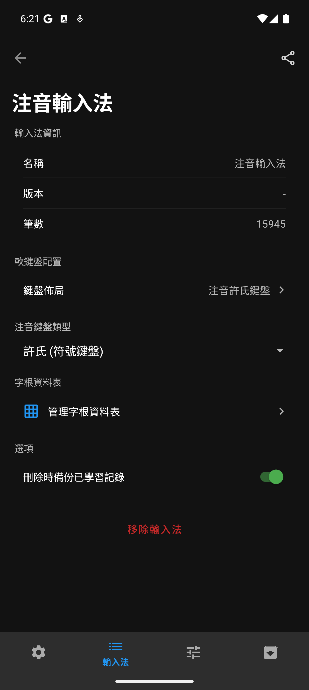
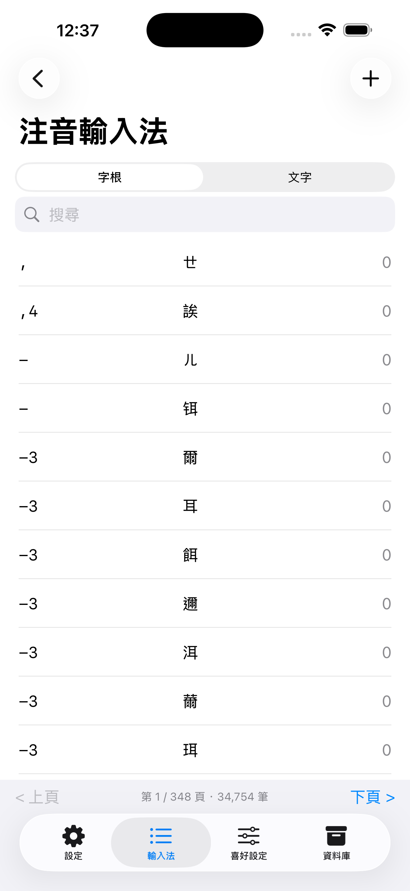
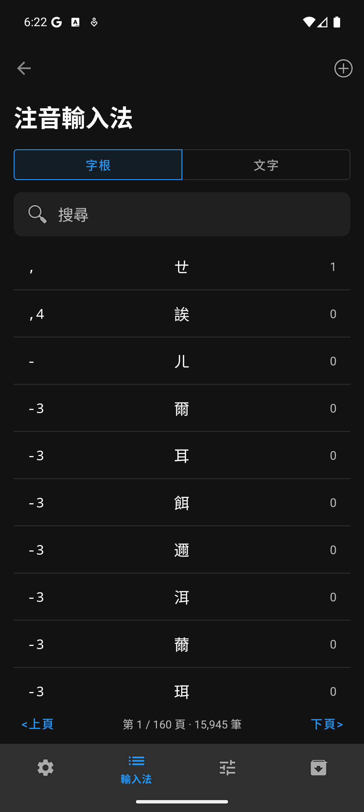
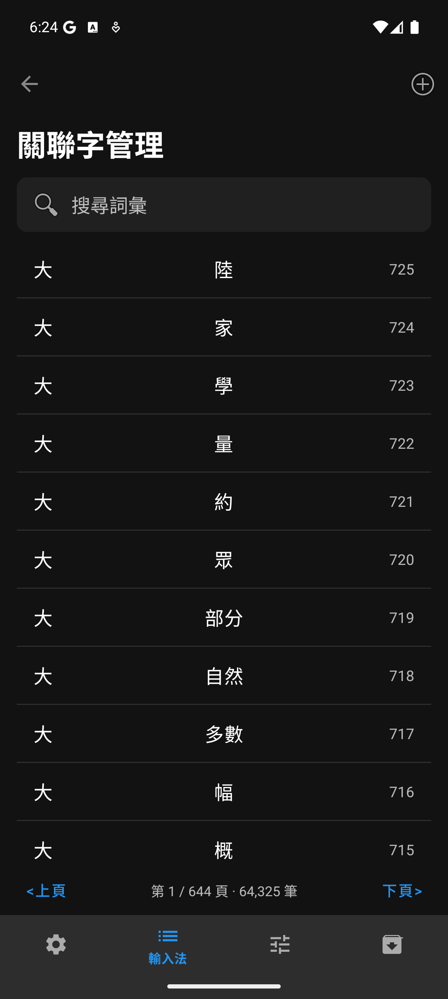

# 輸入法管理

  
輸入法 tab / IM Manager

  <h1>下載、匯入、啟用與編輯輸入法</h1>
  
鍵盤已啟用但沒有中文候選字時，請到「輸入法」分頁確認碼表是否已安裝、是否已啟用，以及是否選到正確的輸入法。

## 輸入法列表

「輸入法」分頁顯示目前安裝的輸入法，新安裝時列表可能還沒有你要的碼表，換機使用者如果剛還原資料庫，則應先確認常用輸入法是否已回到列表中。

  <figure>
    
    <figcaption>iPhone：輸入法列表用來啟用、排序與進入詳細設定。</figcaption>
  </figure>
  <figure>
    
    <figcaption>Android：同一分頁管理已安裝輸入法、下載功能與匯入功能。</figcaption>
  </figure>

輸入法列表提供常用管理動作，使用者可以在同一個分頁完成啟用、排序、進入設定頁面，以及準備單一輸入法的分享與還原。

1. 使用者可用開關啟用或停用輸入法，LIME 會同步更新鍵盤可切換的輸入法清單。已停用的輸入法仍保留在資料庫中，重新啟用後即可再次使用。
2. 使用者可進入編輯模式調整輸入法順序，LIME 會依新的排序顯示輸入法。
3. 使用者可點選輸入法列進入設定頁面，並管理該輸入法的資料、鍵盤佈局與專屬選項。
4. 使用者可在輸入法設定頁面使用分享按鈕匯出 `.limedb`，再到另一台裝置的「輸入法」分頁匯入同一份 `.limedb`，完成單一輸入法的分享、備份或還原。

## 使用情境

  <a class="manual-card" href="quick-start.md#第一個輸入法下載">
    <strong>第一次安裝</strong>
    先下載注音或你熟悉的輸入法，再回到鍵盤測試候選字。
  </a>
  <a class="manual-card" href="database-management.md">
    <strong>換機使用</strong>
    先還原舊裝置的完整資料庫，不要一開始就重新下載碼表。
  </a>
  <a class="manual-card" href="troubleshooting.md">
    <strong>沒有候選字</strong>
    檢查鍵盤模式、目前輸入法、碼表安裝狀態與資料庫狀態。
  </a>

## 下載或匯入輸入法

需要新增碼表時，從「輸入法」分頁開啟下載或匯入功能。官方提供的碼表可從雲端下載，使用者已有碼表檔案時，則使用匯入功能。

  <figure>
    
    <figcaption>iPhone：每個輸入法項目提供下載與匯入功能。</figcaption>
  </figure>
  <figure>
    
    <figcaption>Android：可下載官方碼表，也可匯入本機碼表檔。</figcaption>
  </figure>

### 匯入檔案格式

使用者匯入碼表時，LIME 可接受 `.cin`、`.lime` 與 `.limedb` 三種格式。`.cin` 是傳統中文輸入法社群常見的文字碼表格式，`.lime` 是 LIME 匯出與匯入文字碼表時使用的格式，兩者都適合用文字編輯器檢查字根與候選字。使用者需要確認格式差異、欄位與範例時，請參考 [進階使用](advanced.md#碼表檔案格式)。

`.limedb` 是 LIME 的單一輸入法資料表備份與還原格式。使用者想把某個輸入法分享給其他使用者，或只想把單一輸入法從一台裝置搬到另一台裝置時，請使用 `.limedb`。檔案可保存該輸入法的字根、候選字、分數與輸入法資訊，匯入後會還原到目前選擇的輸入法。關聯字庫也使用 `.limedb`，但關聯字庫檔案必須從「關聯字庫」分組匯入。

下載或匯入後，請立刻回到鍵盤測試：

1. 切到 LIME 中文模式。
2. 選擇剛下載或匯入的輸入法。
3. 輸入該輸入法的字根。
4. 確認候選字列出現候選字。

匯入大型 `.limedb` 或文字碼表時，LIME 需要時間寫入資料庫。請等待下載或匯入流程完成後，再回到鍵盤測試候選字。

匯入會覆蓋既有輸入法資料的檔案前，請先到「資料庫」分頁備份目前資料庫。匯入錯誤檔案或覆蓋既有資料後，完整資料庫備份是最可靠的回復方式。

## 輸入法設定頁面

輸入法設定頁面管理單一輸入法。使用者可以在這裡確認碼表狀態、調整顯示名稱、選擇鍵盤佈局、設定該輸入法專屬選項，並進入字根資料表進行編輯。

不同輸入法會顯示不同的設定項目。注音輸入法會顯示注音鍵盤類型，行列 10 會顯示電話鍵盤設定，自建輸入法會顯示數字與符號字根設定。

  <figure>
    
    <figcaption>iPhone：設定頁面管理單一輸入法的資訊與專屬設定。</figcaption>
  </figure>
  <figure>
    
    <figcaption>Android：設定頁面用來確認碼表狀態與進入資料表操作。</figcaption>
  </figure>

這個頁面也提供匯出與移除功能。使用者需要修改單一輸入法時，請在該輸入法的設定頁面處理。

### 輸入法資訊

「名稱」、「版本」與「結束鍵」是可編輯欄位，使用者點選欄位後可修改單一項目，LIME 會在儲存後更新設定頁面與輸入法列表。

「名稱」不可留空，因為輸入法列表需要顯示可辨識的名稱。「版本」與「結束鍵」可以留空，畫面會以空值狀態呈現。

「筆數」顯示該輸入法目前的字根資料數量，使用者可用這個數字確認下載、匯入或清除資料後的資料表狀態。

### 軟鍵盤配置

「鍵盤佈局」會開啟可用鍵盤列表，使用者選擇後，LIME 會把該輸入法連到指定的軟鍵盤配置。

注音輸入法更換鍵盤佈局時，LIME 也會同步更新注音鍵盤類型，讓畫面鍵位與資料庫層的注音對應保持一致。

### 注音鍵盤類型

注音輸入法會顯示「注音鍵盤類型」選項，使用者可選擇標準、倚天 41 鍵、倚天 26 鍵、倚天 26 鍵符號鍵盤、許氏鍵盤或許氏符號鍵盤。

這個選項只出現在注音輸入法設定頁面，因為它同時影響注音可見鍵盤與注音字根對應。

### 電話鍵盤設定

行列 10 輸入法會顯示「自動上屏」設定，使用者可選擇無自動上屏，或指定第 4 到第 10 筆畫後自動送出候選字。

這個設定只適用於行列 10 的電話鍵盤輸入方式，其他輸入法不會顯示這個選項。

### 自建輸入法設定

自建輸入法會顯示「數字字根對應」與「符號字根對應」，使用者可決定自建碼表是否允許數字或符號作為字根。

官方碼表使用各自固定的字根規則，這兩個選項只會出現在自建輸入法設定頁面。

### 匯出與移除輸入法

輸入法設定頁面的分享按鈕用來匯出目前這個輸入法。使用者想分享碼表、把單一輸入法搬到另一台裝置，或在修改字根資料前保留單一輸入法備份時，可以使用這個按鈕。

一般輸入法可匯出 `.lime` 文字檔或 `.limedb` 資料庫檔。需要用文字編輯器檢查或修改字根時，請匯出 `.lime`。需要保留候選字分數與輸入法資訊，或要讓另一台裝置直接匯入同一份輸入法資料時，請匯出 `.limedb`。

關聯字庫只匯出 `.limedb`，因為關聯字庫使用自己的資料表格式，不是一般輸入法文字碼表。

「移除輸入法」會清除該輸入法的對應資料，使用者執行前應確認是否保留已學習記錄的備份。

「刪除時備份已學習記錄」開啟時，LIME 會在清除資料前先備份學習記錄，讓使用者日後重新匯入時有機會還原學習資料。

## 編輯字根資料

字根資料決定你輸入哪些按鍵後會出現哪些候選字，進入資料表後，可以瀏覽、搜尋、新增、編輯或刪除記錄。大量修改前請先備份資料庫，修改後回到鍵盤用實際字根測試。

  <figure>
    
    <figcaption>iPhone：字根資料列表用來查找與編輯單筆碼表記錄。</figcaption>
  </figure>
  <figure>
    
    <figcaption>Android：可在列表中搜尋、編輯或刪除字根資料。</figcaption>
  </figure>

編輯後請確認三件事：

1. 輸入同一組字根時，候選字是否如預期出現。
2. 候選排序是否符合你修改的分數或資料順序。
3. 其他同碼候選字是否仍保留。

資料表每頁顯示固定數量的記錄，使用者可透過搜尋字根或搜尋文字縮小資料範圍。

新增或編輯記錄時，使用者需要填寫字根、候選字與分數，分數會影響同碼候選字的排序。

刪除記錄前，使用者應確認目前正在修改的是正確輸入法，因為字根資料會直接影響鍵盤候選字。

## 編輯關聯字詞

關聯字詞影響選字後下一個候選提示，例如選了某個字後，LIME 可依關聯字庫提示下一個常見字或詞。這類資料會影響連續輸入體驗，但不等同字根本身。

  <figure>
    
    <figcaption>iPhone：關聯字詞列表管理選字後的後續候選提示。</figcaption>
  </figure>
  <figure>
    
    <figcaption>Android：可新增、編輯或刪除關聯字詞資料。</figcaption>
  </figure>

如果關聯字提示變得不自然，請先檢查「喜好設定」中的關聯字與學習選項，再確認最近是否還原資料庫、匯入碼表或大量編輯關聯字詞。

關聯字庫有自己的列表與編輯畫面，使用者可搜尋關聯字、新增關聯組合、修改分數或刪除不需要的關聯資料。

新增或編輯關聯字時，使用者需要確認主要字詞、關聯字詞與分數，分數會影響後續候選提示的排序。

## 下載與匯入項目

下載與匯入畫面依輸入法分組，官方碼表項目會顯示雲端下載、本機 `.limedb` 匯入，以及 `.cin` / `.lime` 文字碼表匯入。

下載與匯入畫面包含多個常見分組，例如注音、倉頡、倉頡五代、快倉、速成、大易、輕鬆、行列、行列 10、拼音、華象直覺、筆順五碼、自建與關聯字庫。

注音、倉頡、大易、拼音與華象直覺可能提供多個雲端版本，使用者應依自己的字集或輸入習慣選擇對應項目。

「自建」分組不提供雲端下載，使用者需要匯入自己的 `.limedb`、`.cin` 或 `.lime` 檔案。

「關聯字庫」分組負責關聯資料匯入，使用者匯入前應確認檔案來源屬於關聯字庫，而不是一般輸入法碼表。

## 學習記錄還原

如果 LIME 偵測到某個輸入法有備份過的學習記錄，下載或匯入畫面會顯示「還原已學習記錄」選項。

使用者開啟這個選項後，LIME 會在重新下載或匯入碼表後嘗試帶回學習資料，讓候選排序比較接近原本的使用狀態。

如果使用者想完全重建碼表並放棄舊排序，使用者可以關閉「還原已學習記錄」後再匯入。

## 異常狀態處理

輸入法列表是空的：新安裝時請下載或匯入碼表，換機後若列表空白，請回到「資料庫」分頁確認還原檔與還原結果。

下載後沒有候選字：確認目前鍵盤是 LIME 中文模式，且目前選到剛下載的輸入法。

匯入後資料異常：使用者先不要連續覆蓋，請備份目前狀態，確認檔案格式與來源，再改用另一份檔案測試。
