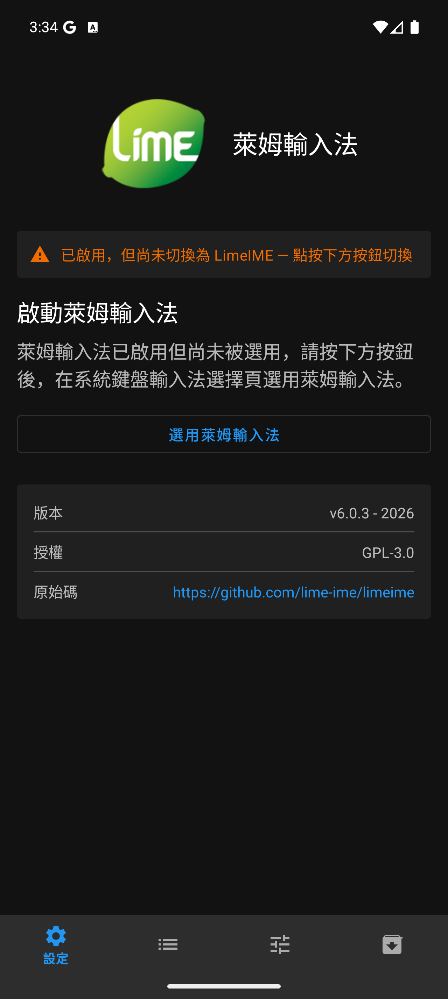
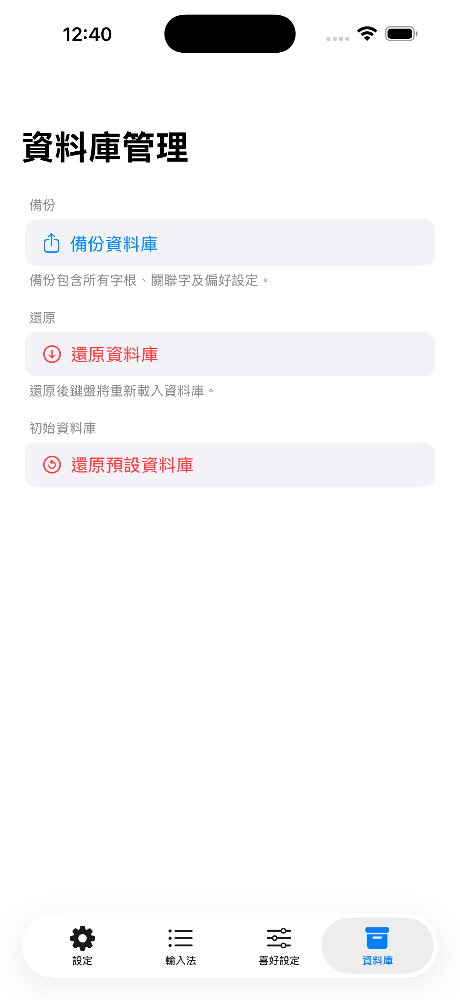
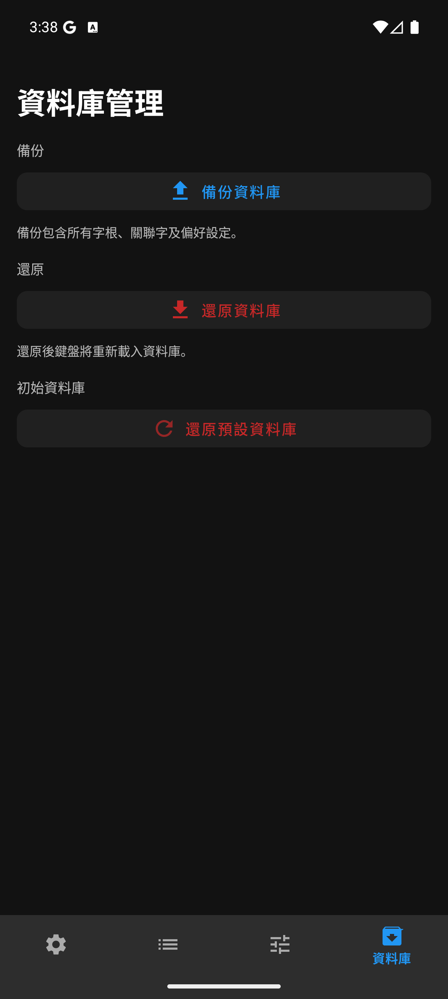
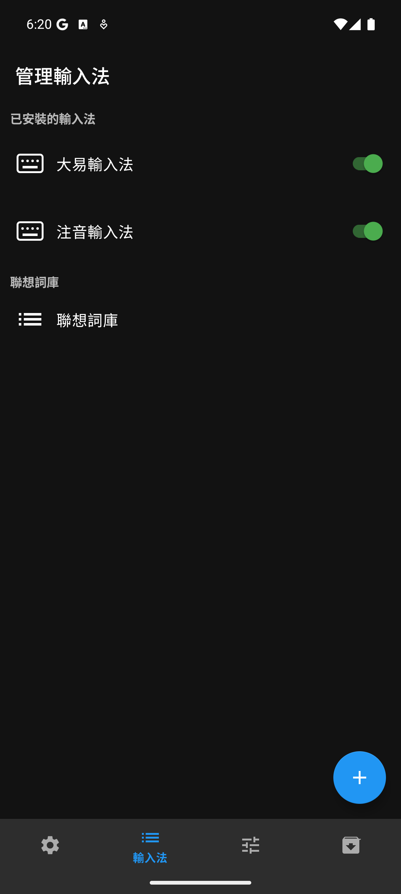
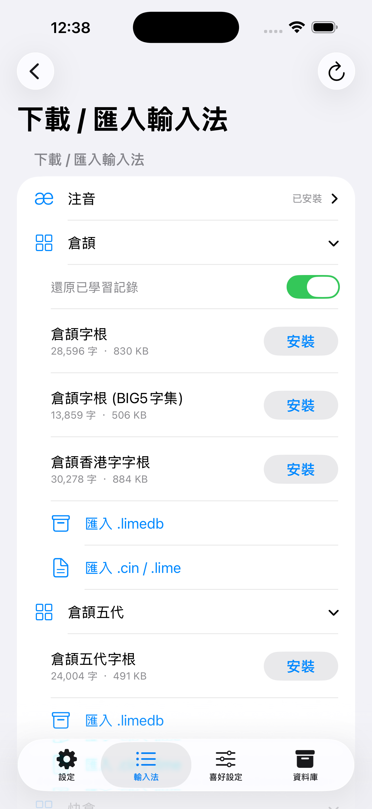
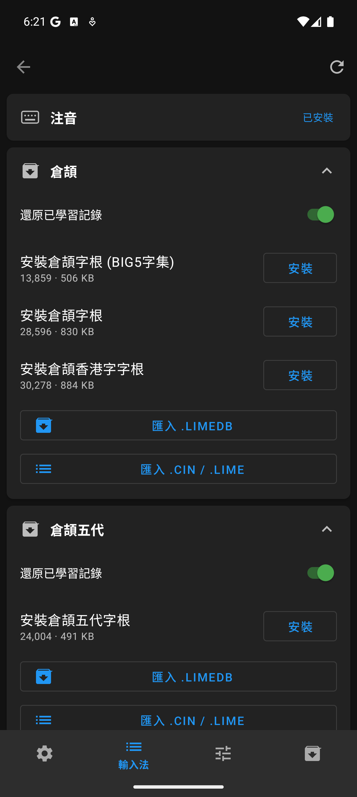

# 快速設定

快速設定分成三步驟。使用者先啟用 LIME 鍵盤，再還原舊資料或安裝輸入法，最後切到 LIME 並用一般文字欄位測試。

  <a class="manual-card" href="#啟用-lime">
    <strong>1. 啟用 LIME</strong>
    從 LIME「設定」分頁前往系統鍵盤設定，開啟 LIME 鍵盤。
  </a>
  <a class="manual-card" href="#還原資料庫或安裝輸入法">
    <strong>2. 準備輸入法</strong>
    有舊裝置就還原完整資料庫，沒有舊資料就下載或匯入第一個輸入法。
  </a>
  <a class="manual-card" href="#切換到-lime-並測試">
    <strong>3. 切換並測試</strong>
    切到 LIME 中文模式，輸入字根，確認候選字列出現候選字。
  </a>

第一次開啟 LIME 設定 App 時，請進入「設定」分頁，畫面會顯示 LIME 標誌、目前鍵盤狀態、設定步驟，以及前往系統設定的按鈕。

  <figure>
    
    <figcaption>iPhone：設定分頁用來確認鍵盤是否已加入系統鍵盤清單。</figcaption>
  </figure>
  <figure>
    
    <figcaption>Android：設定分頁同時顯示鍵盤啟用與語音輸入權限狀態。</figcaption>
  </figure>

設定分頁的作用是確認系統是否已經允許 LIME 鍵盤出現在輸入欄位，完成這一步後，再處理資料庫還原或輸入法安裝。

## 狀態提示

設定分頁上方會顯示狀態提示，它會在你回到 App、App 重新啟用，以及短時間輪詢時更新。

常見狀態可以這樣解讀：

- 鍵盤尚未啟用：還沒有把 LIME 加入系統鍵盤清單。
- 鍵盤已啟用：可以到文字欄位切換到 LIME。
- iPhone 顯示尚未允許完整取用：代表 LIME 按鍵震動回饋無法使用，文字輸入請用一般文字欄位另外測試。
- Android 語音輸入尚未啟用：只影響 LIME 內建語音輸入，仍可略過並使用 Google/系統語音輸入 fallback。

## 啟用 LIME

### Android

1. 開啟 LIME 設定 App。
2. 在「設定」分頁點選前往設定的按鈕。
3. 到 Android 系統輸入法設定啟用 LIME。
4. 回到 LIME 設定 App。
5. 確認設定分頁顯示鍵盤已啟用。

請先完成 LIME 啟用，再依下一步還原資料庫或安裝輸入法。不要用密碼、電話、數字或日期欄位測試一般中文輸入，這些欄位可能使用系統鍵盤或受限鍵盤。

### Android 語音輸入權限

如果設定分頁顯示語音輸入權限狀態，請依需要處理：

| 狀態 | 代表意思 | 你可以怎麼做 |
|------|----------|--------------|
| 萊姆內建語音輸入已啟用 | 已允許麥克風 | 可直接使用 LIME 內建語音輸入 |
| 萊姆內建語音輸入尚未啟用 | 尚未允許麥克風或仍可詢問 | 想用內建語音輸入就允許，不想用可略過 |
| 需至系統設定開啟麥克風權限 | Android 不再跳出授權視窗 | 到系統 App 資訊 → 權限 → 麥克風 → 允許 |

即使不開啟 LIME 內建語音輸入，LIME 仍會嘗試使用 Google/系統語音輸入或其他 fallback。

### iPhone

1. 開啟 LIME 設定 App。
2. 在「設定」分頁點選前往設定的按鈕。
3. 在系統鍵盤設定中開啟 LIME。
4. 回到 LIME 設定 App。
5. 確認設定分頁顯示鍵盤已啟用。

如果前往設定按鈕無法開啟正確位置，請改從 iOS「設定」進入「一般」→「鍵盤」→「鍵盤」→「新增鍵盤」，再選擇 LIME。

「允許完整取用」只用於 LIME 的按鍵震動回饋，若不需要打字震動，可以不開啟，LIME 不會收集或傳送個人資料。

### iPad

iPad 的啟用流程和 iPhone 相同，請先從 LIME「設定」分頁點選前往設定，開啟 LIME 鍵盤後再回到 LIME 設定 App。完成輸入法準備後，請在最後測試：

- 直向與橫向是否都能叫出 LIME。
- 是否需要分割鍵盤。
- 副鍵符號與下滑輸入是否符合使用習慣。

iPad 13 吋、11 吋、mini 尺寸分級仍是未實作規劃，不是目前需要設定的功能。

## 還原資料庫或安裝輸入法

LIME 啟用後，下一步取決於你是否已有舊裝置資料。有舊裝置時，請先還原完整資料庫。沒有舊資料時，請下載或匯入第一個輸入法。

### 舊裝置資料還原

如果你有任何舊手機、舊平板或目前仍在使用的 LIME 裝置，換機時請優先使用資料庫備份與還原。

  <figure>
    
    <figcaption>iPhone：換機前先在舊裝置備份資料庫。</figcaption>
  </figure>
  <figure>
    
    <figcaption>Android：新裝置可用還原資料庫取回舊資料。</figcaption>
  </figure>

操作順序：

1. 在舊裝置開啟 LIME 設定 App。
2. 進入「資料庫」分頁。
3. 點選「備份資料庫」。
4. 把備份檔存到新裝置可以取得的位置。
5. 在新裝置完成 LIME 鍵盤啟用。
6. 進入「資料庫」分頁，點選「還原資料庫」。

資料庫備份包含所有字根、關聯字及喜好設定，還原會取代新裝置目前的 LIME 資料，若新裝置已經輸入或匯入過資料，請先備份新裝置資料。

### 第一個輸入法下載

全新安裝且沒有舊裝置備份時，鍵盤啟用後請進入「輸入法」分頁下載或匯入第一個輸入法。LIME 需要輸入法碼表才能產生中文候選字，鍵盤已經出現但尚未安裝碼表時，使用者可能只能看到鍵盤，卻看不到中文候選字。

如果你曾經在其他裝置使用 LIME，請先回到「舊裝置資料還原」小節，使用完整資料庫還原碼表、學習詞、關聯字詞與喜好設定。只有在你是全新使用者，或確定不需要舊資料時，才開始下載第一個輸入法。

  <figure>
    
    <figcaption>iPhone：先確認輸入法列表是否已有可用碼表。</figcaption>
  </figure>
  <figure>
    
    <figcaption>Android：列表空白時，請下載或匯入第一個輸入法。</figcaption>
  </figure>

操作順序：

1. 開啟 LIME 設定 App。
2. 進入「輸入法」分頁。
3. 查看目前已安裝的輸入法列表。
4. 如果列表沒有你要使用的輸入法，請進入下載或匯入畫面。
5. 下載官方碼表，或匯入自己的 `.cin`、`.lime`、`.limedb` 檔案。

常見起點：

- 注音：適合多數繁體中文使用者，也是最容易確認 LIME 中文鍵盤與候選列是否正常的起點。
- 倉頡或速成：適合熟悉字形拆碼的使用者。
- 大易、行列或其他碼表：適合已有固定輸入習慣的使用者。
- 自訂碼表：如果你已有 `.cin`、`.lime` 或 `.limedb` 檔案，請走匯入流程。

注音鍵盤類型只套用在注音輸入法，使用者需要在注音輸入法設定頁面調整這個選項。

  <figure>
    
    <figcaption>iPhone：下載畫面列出可安裝的輸入法與匯入方式。</figcaption>
  </figure>
  <figure>
    
    <figcaption>Android：可從同一畫面下載官方碼表或匯入本機檔案。</figcaption>
  </figure>

如果你有本機碼表檔，請使用匯入功能。Android 從檔案選擇器挑選檔案，iPhone/iPad 可透過「檔案」App 或分享選單把檔案交給 LIME。匯入會覆蓋既有輸入法資料的檔案前，請先到「資料庫」分頁備份目前資料庫。

## 切換到 LIME 並測試

啟用 LIME 並準備輸入法後，請用一般文字欄位測試，不要使用密碼、電話、數字或日期欄位。

操作順序：

1. 開啟任意可輸入一般文字的 App。
2. 切換到 LIME 鍵盤。
3. 切到 LIME 中文模式。
4. 選擇剛還原、下載或匯入的輸入法。
5. 輸入該輸入法的字根。
6. 確認候選字列出現候選字。

請確認以下狀態：

- 系統鍵盤清單可以切到 LIME。
- 中文模式有候選字列。
- 英文模式有 `中` 鍵。
- 注音輸入法可看到注音鍵位。
- iPhone/iPad 的候選列左側提供 Emoji 面板按鈕。

如果仍無法輸入中文，請依序檢查：

1. 輸入法列表中是否真的有剛還原、下載或匯入的輸入法。
2. 鍵盤目前是否在中文模式。
3. 目前選用的輸入法是否就是你剛準備的輸入法。
4. 輸入的字根是否符合該輸入法。
5. 是否在密碼、電話、數字等受限欄位測試。

若鍵盤沒有出現，或出現後不能輸入中文，請看 [常見問題排查](troubleshooting.md)。
