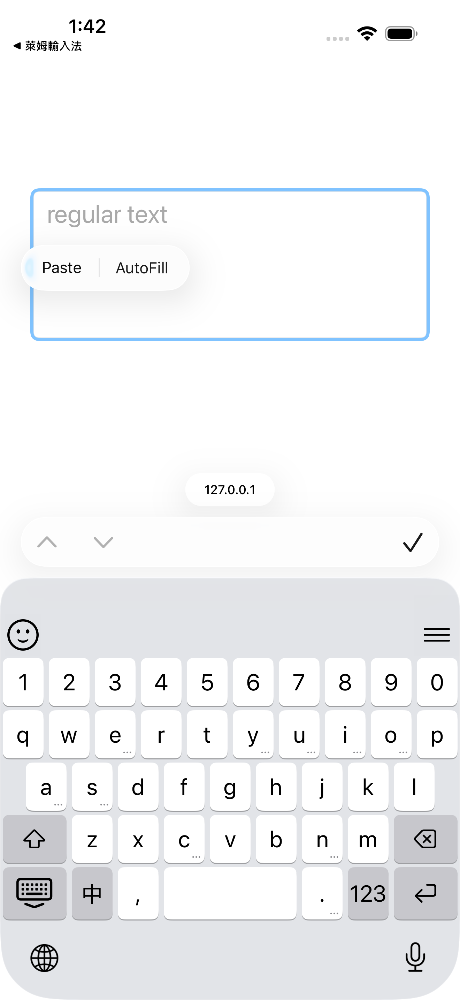
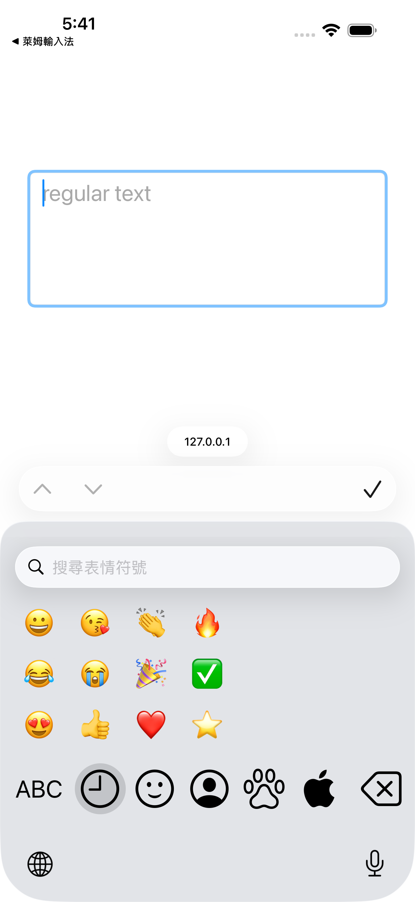

# 鍵盤輸入

  
鍵盤輸入操作

  <h1>候選列、鍵盤畫面與輸入模式</h1>
  
LIME 鍵盤出現在文字欄位後，畫面會由候選列與鍵盤區組成，使用者可依目前版面輸入中文碼、英文、符號與 Emoji。

## 鍵盤畫面

LIME 輸入畫面通常分成候選列與鍵盤區，候選列位在鍵盤上方，鍵盤區位在候選列下方。

  <figure>
    
    <figcaption>Android 鍵盤畫面，候選列位在鍵盤上方，右側固定按鈕可顯示麥克風或鍵盤功能。</figcaption>
  </figure>
  <figure>
    
    <figcaption>iPhone 鍵盤畫面，候選列位在鍵盤上方，左右固定按鈕提供 Emoji 與鍵盤功能。</figcaption>
  </figure>

候選列負責顯示輸入碼、中文候選字、英文建議字與固定位置按鈕。中文模式會把目前輸入中的輸入碼放在候選列第 0 項，候選列左右兩側也可能顯示 Emoji、麥克風、選單或鍵盤收合按鈕。

鍵盤區負責顯示目前鍵盤版面，版面會依中文輸入法、英文模式、符號模式、Emoji 面板、iPhone、Android 與 iPad 而改變。中文輸入法會顯示字根或注音鍵位，英文模式會顯示英文字母，符號模式會顯示標點、數字與符號。

鍵盤區的按鍵可分成一般鍵與功能鍵，一般鍵會輸入字根、字母或符號，功能鍵會切換模式、刪除文字、輸入空白、收合鍵盤或開啟鍵盤功能選單。

一般鍵如果在鍵帽右下角或下方顯示 `...`，代表這顆鍵支援長按迷你鍵盤。使用者長按這顆鍵後，LIME 會顯示可選字元或功能，使用者可滑到目標項目後放開。

## 中文輸入

使用者切到 LIME 中文模式後，鍵盤上方應出現候選字列，注音輸入法應顯示注音鍵位，其他輸入法則會依目前碼表顯示對應鍵盤。

  <figure>
    
    <figcaption>Android 中文模式，使用者應看到注音鍵位與候選字列。</figcaption>
  </figure>
  <figure>
    
    <figcaption>iOS 中文模式，候選列左側可開啟 Emoji 面板。</figcaption>
  </figure>

使用者輸入中文時，請依序完成這些動作：

1. 使用者確認「輸入法」分頁已安裝至少一個中文輸入法。
2. 使用者切到 LIME 中文模式，並確認候選字列出現在鍵盤上方。
3. 使用者選擇要使用的輸入法，並輸入該輸入法的字根。
4. LIME 會依目前碼表顯示候選字，使用者再從候選字列選字。
5. 如果候選字太多，使用者可以繼續輸入更多字根，讓 LIME 縮小候選字範圍。

如果使用者需要切換鍵盤，使用者可長按或點按地球儀鍵，並從鍵盤清單選擇 LIME。

## 中文鍵盤混合輸入

LIME 中文鍵盤支援中英混合輸入，候選列第 0 項會固定顯示目前輸入中的輸入碼，使用者點選第 0 項時，LIME 會直接送出這串輸入碼。

這個行為讓使用者在中文模式中輸入英文縮寫、產品名稱、帳號片段或程式代碼時，不必每次切到英文鍵盤。使用者輸入 `lime` 時，候選列第 0 項會保留 `lime`，使用者點選它後，文字欄位會輸入 `lime`。

如果「啟用英文建議字」已開啟，LIME 會在輸入碼長度超過目前輸入法碼長後，於候選列加入英文字典建議字。多數輸入法的碼長門檻是 4 碼，所以使用者輸入第 5 個英文字母後，LIME 可能會顯示英文單字建議。倉頡輸入法的碼長門檻是 5 碼，所以使用者輸入第 6 個英文字母後，LIME 才會檢查英文單字建議。

中文候選字與英文建議字會共用同一條候選列，LIME 會把輸入碼放在第 0 項，並依目前碼表、關聯建議與英文字典決定後續候選項目。使用者要輸入中文時，請選擇中文候選字，使用者要輸入英文原文時，請選擇第 0 項，使用者要接受英文建議字時，請選擇候選列中的英文單字。

如果中文鍵盤沒有出現英文建議字，使用者應檢查 [喜好設定](preferences.md) 的「啟用英文建議字」，並確認目前輸入內容已超過該輸入法的碼長門檻。

## 英文輸入

使用者切到 LIME 英文模式後，鍵盤可以直接輸入英文字母，鍵盤上的 `中` 鍵會把輸入狀態切回中文模式。

  <figure>
    
    <figcaption>Android 英文模式，使用者應看到可切回中文的 <code>中</code> 鍵。</figcaption>
  </figure>
  <figure>
    
    <figcaption>iOS 英文模式，使用者應看到可切回中文的 <code>中</code> 鍵。</figcaption>
  </figure>

「首字自動大寫」開啟時，LIME 會在英文句首、換行後，或 `. `、`! `、`? ` 之後自動切到 shifted 狀態。常見英文縮寫後面的句點不會被當成新句子的開頭，例如 `U.S.` 或 `Dr.` 後面不會強制觸發句首大寫。

## 英文預測與自動補字

使用者在英文模式輸入英文字母時，如果「啟用英文建議字」已開啟，LIME 會追蹤目前正在輸入的英文單字，並在候選列顯示英文預測字。

iPhone 與 iPad 會使用 iOS 的 `UITextChecker` 產生英文補字，Android 會使用 LIME 的英文字典資料產生英文補字。兩個平台都不會預設反白英文候選字，使用者需要明確點選候選列中的英文建議字。

使用者點選英文建議字時，LIME 只會補上尚未輸入的後綴，並在單字後面加入空白。使用者已輸入 `sal` 並點選 `salt` 時，LIME 會補上 `t `，文字欄位會得到 `salt `。

如果使用者點選英文建議字後立刻輸入標點，LIME 會調整自動加入的空白位置。使用者選完 `salt` 後再輸入逗號時，LIME 會輸出 `salt, `，而不是 `salt ,`。

Android 英文預測會把目前輸入中的英文單字放入候選列，當字典沒有其他非完全相同的建議字時，候選列仍會顯示這個可點選的輸入字。Android 也會記錄使用者點選過的英文建議字，常被選取的單字會在後續預測中提高排序。

如果 LIME 的 Emoji 建議功能已開啟，英文預測列也可能顯示與英文單字相關的 Emoji，使用者可直接點選 Emoji 候選項目。

## 切換 LIME 輸入法與系統鍵盤

LIME 有兩種不同的切換操作，使用者切換 LIME 內部輸入法時，仍然停留在 LIME 鍵盤內，使用者切換系統鍵盤時，會離開 LIME 並切到其他系統輸入法。

`中` 或 `ABC` 鍵只切換 LIME 的中文模式與英文模式，這個按鍵不會切換注音、倉頡、大易、行列等 LIME 內部輸入法，也不會切換到其他系統鍵盤。

使用者要切換 LIME 內部輸入法時，可以長按空白鍵開啟 LIME 輸入法選單，然後選擇已啟用的輸入法。iPhone 與 iPad 也可以點按候選列右側的選單鍵，從鍵盤功能選單選擇「LIME 輸入法切換」。Android 可以長按鍵盤收合鍵開啟鍵盤功能選單，然後選擇輸入法清單。

使用者要切換系統鍵盤時，iPhone 與 iPad 可以點按地球儀鍵切到下一個系統鍵盤，也可以長按地球儀鍵開啟系統鍵盤清單。Android 可以從 LIME 的鍵盤功能選單選擇系統輸入法，實際清單由 Android 系統提供。

LIME 會記住上次選取的 LIME 內部輸入法，下一次回到中文模式時，鍵盤會使用該輸入法的版面。

## Shift 與 Caps Lock

鍵盤上的 Shift 鍵控制目前版面的 shifted 狀態，中文鍵盤與英文鍵盤都會依版面定義切換到對應鍵位。

| 操作 | 鍵盤狀態 | 輸入結果 |
|------|----------|----------|
| 點按 Shift 一次 | Shift 進入單次 shifted 狀態，鍵盤會顯示 shifted 鍵位。 | 使用者輸入下一個按鍵後，LIME 會回到一般狀態。 |
| 在單次 shifted 狀態再點按 Shift | Shift 會取消單次 shifted 狀態，鍵盤會回到一般鍵位。 | 使用者接著輸入的按鍵會使用一般狀態。 |
| 雙擊 Shift | LIME 會進入 Caps Lock 狀態，鍵盤會持續顯示 shifted 鍵位。 | 使用者可連續輸入 shifted 鍵位，直到再次點按 Shift。 |
| Caps Lock 狀態點按 Shift | LIME 會離開 Caps Lock 狀態，鍵盤會回到一般鍵位。 | 使用者接著輸入的按鍵會使用一般狀態。 |
| 長按 Shift | LIME 會在手指按住 Shift 期間顯示 shifted 鍵位。 | 使用者按住 Shift 時輸入的按鍵會使用 shifted 鍵位，放開 Shift 後鍵盤會回到一般狀態。 |

英文鍵盤的 shifted 鍵位通常是大寫字母，中文鍵盤的 shifted 鍵位則依輸入法版面提供符號、替代字根或 shifted 字母。

iPad 鍵盤可能在左右兩側各有一顆 Shift 鍵，兩顆 Shift 鍵控制同一個 shifted 狀態。

## 欄位類型會改變鍵盤

系統會依文字欄位類型調整鍵盤，密碼、電話、數字與日期欄位可能改用受限鍵盤，所以使用者測試 LIME 時應使用備忘錄、訊息輸入框或其他一般文字欄位。

如果一般文字欄位沒有顯示 LIME 鍵盤，使用者應完成 [快速設定](quick-start.md)。如果一般文字欄位能顯示 LIME 鍵盤，但是中文候選字一直是空的，使用者應檢查 [輸入法管理](ime-management.md)。

| 欄位類型 | LIME 行為 | 使用者應注意 |
|----------|-----------|--------------|
| 一般文字欄位 | LIME 會依一般文字欄位處理，記憶中英模式開啟時會沿用上次中文或英文狀態，關閉時不會讀取上次狀態。 | 使用者測試中文輸入時，應優先使用這類欄位。 |
| 電話欄位 | Android 會使用受限電話數字鍵盤，iPhone/iPad 通常由系統電話鍵盤處理。 | 鍵盤會以電話號碼需要的數字與符號為主。 |
| 數字欄位 | Android 會使用受限數字鍵盤，iPhone/iPad 可能使用符號或數字相關鍵盤。 | 這類鍵盤通常不提供中文或英文模式切換鍵。 |
| Email 欄位 | Android、iPhone 與 iPad 會使用英文鍵盤，英文預測會關閉，記憶中英模式不會改變這個行為。 | 使用者仍可輸入 `@`、`.`、`-`、`_` 等 Email 常用符號。 |
| 密碼欄位 | Android 會使用英文鍵盤並關閉預測，iPhone/iPad 通常會改用系統安全鍵盤。 | Android 仍由 LIME 顯示鍵盤，iPhone/iPad 則可能完全不顯示 LIME。 |
| URL 與搜尋欄位 | 現代網址列常用來輸入搜尋關鍵字，所以 LIME 會把 URL 與搜尋欄位當作一般文字欄位處理，使用者仍可輸入中文搜尋關鍵字。 | 記憶中英模式開啟時會沿用上次中文或英文狀態，關閉時不會讀取上次狀態，Enter 鍵可能依欄位顯示搜尋或前往動作。 |

「記憶中英模式」開啟時，LIME 會記住使用者上次切換後的中文或英文狀態，下一次進入一般文字、URL 或搜尋欄位時，鍵盤會沿用該狀態。

「記憶中英模式」關閉時，LIME 不會沿用上次中文或英文狀態。下一次進入一般文字、URL 或搜尋欄位時，如果使用者已啟用中文輸入法，鍵盤會載入目前啟用的中文輸入法版面，如果尚未啟用中文輸入法，鍵盤會使用平台的英文備援鍵盤。

## Emoji 輸入

使用者開啟 Emoji 面板後，畫面會顯示搜尋列、Emoji 網格與底部分類列，這三個區域對應搜尋、選字與分類切換。

  <figure>
    
    <figcaption>Android Emoji 面板，使用者應看到搜尋列、Emoji 網格與底部分類列。</figcaption>
  </figure>
  <figure>
    
    <figcaption>iOS Emoji 面板，使用者應看到搜尋列、Emoji 網格與底部分類列。</figcaption>
  </figure>

如果使用者想回到文字輸入，請使用 Emoji 面板上的返回或模式切換鍵，LIME 會回到中文或英文鍵盤。

## 符號與標點輸入

使用者需要符號時，請先使用符號切換鍵進入符號頁，中文模式會依 LIME 設定提供中文標點或標點轉換。

常見符號輸入方式包含三種，使用者可以依目前鍵盤狀態選擇最方便的方式。

1. 使用者可在符號頁直接點選符號，這是最穩定的方式。
2. 使用者可長按支援迷你鍵盤的按鍵，然後滑到需要的字元再放開。
3. iPad 使用者可依按鍵上的副鍵符號提示，使用下滑或長按輸入符號。

## 長按迷你鍵盤

鍵盤按鍵右下角或下方顯示 `...` 時，代表這顆按鍵支援長按迷你鍵盤，使用者長按後會看到可選字元或功能鍵。

迷你鍵盤出現後，使用者應保持手指在畫面上，滑到要輸入的字元後再放開，LIME 會輸入被選取的迷你鍵盤項目。

如果長按後只出現單一選項，LIME 可能會直接輸入該選項，使用者不一定會看到多鍵迷你鍵盤。

迷你鍵盤和 iPad 副鍵符號不同，`...` 代表長按後有一組可選項目，iPad 副鍵符號則通常是在按鍵上直接顯示第二個字元。

## 候選列按鈕

LIME 的候選列除了顯示候選字，也會在固定左側或右側提供常用按鈕，使用者點按候選列按鈕時會開啟對應面板或功能。

這裡的舊版 iPhone 指有 Home 鍵的 iPhone，例如 iPhone SE 或 iPhone 8，當 iOS 要求第三方鍵盤在鍵盤內提供系統鍵盤切換鍵時，LIME 會啟用這個版面行為。

| 候選列按鈕 | 固定位置 | 點按操作 | 長按操作 |
|------------|----------|----------|----------|
| Emoji 鍵 | Android、iPhone 與 iPad 候選列左側。 | LIME 會開啟 Emoji 面板，使用者可搜尋、選字或切換分類。 | LIME 沒有定義獨立長按功能，使用者以點按開啟 Emoji 面板。 |
| Android 麥克風鍵 | Android 候選列右側。 | LIME 會啟動 Android 語音輸入流程，系統可能使用 LIME 內建語音、Google 語音輸入或語音辨識 fallback。 | LIME 沒有定義獨立長按功能，使用者以點按啟動語音輸入。 |
| iOS 選單鍵 | iPhone 與 iPad 候選列右側，外觀常見為三橫線選單。 | LIME 會開啟鍵盤功能選單，使用者可處理輸入法切換、反查或繁簡轉換。 | LIME 沒有定義獨立長按功能，使用者以點按開啟鍵盤功能選單。 |
| 舊版 iPhone 鍵盤鍵 | 舊版 iPhone 版面候選列右側，外觀為鍵盤收合圖示。 | LIME 會收合鍵盤，使用者可回到文字欄位內容。 | LIME 會開啟鍵盤功能選單，使用者可切換 LIME 輸入法、反查來源或繁簡轉換。 |

iPhone 與 iPad 版 LIME 不提供麥克風按鈕，因為 iOS 第三方鍵盤延伸功能不能自行錄音，也不能直接啟動系統聽寫。

## 鍵盤功能鍵

LIME 鍵盤本體的功能鍵負責模式切換、鍵盤收合、游標操作與鍵盤選單，使用者點按功能鍵時會立即執行主要功能，使用者長按功能鍵時會開啟延伸功能。

| 按鍵 | 點按操作 | 長按操作 |
|------|----------|----------|
| `中` 或 `ABC` 鍵 | LIME 會在中文模式與英文模式之間切換，使用者可直接回到需要的輸入狀態。 | LIME 依目前鍵盤配置處理，通常不需要另外長按。 |
| Shift 鍵 | LIME 會切換單次 shifted 狀態、取消單次 shifted 狀態或離開 Caps Lock，使用者也可雙擊進入 Caps Lock。 | LIME 會在手指按住期間顯示 shifted 鍵位，放開後回到一般狀態。 |
| 符號切換鍵 | LIME 會進入符號鍵盤或返回文字鍵盤，使用者可輸入標點、數字與符號。 | LIME 依目前符號鍵盤配置處理，通常不需要另外長按。 |
| 刪除鍵 | LIME 會刪除游標前的字元，組字中會先刪除字根或組字內容。 | LIME 可連續刪除，實際速度依平台與目前輸入狀態而定。 |
| 空白鍵 | LIME 會輸入空白，中文組字中則依目前輸入法處理候選或組字狀態。 | LIME 會開啟內部輸入法選單，使用者可在已啟用的 LIME 輸入法之間切換。 |
| Android 鍵盤收合鍵 | LIME 會收合螢幕鍵盤，使用者可回到文字欄位內容。 | LIME 會開啟鍵盤功能選單，選單可包含喜好設定、反查來源、繁簡轉換、輸入法清單、系統輸入法選擇、分割鍵盤與語音輸入。 |
| iPhone 或 iPad 鍵盤收合鍵 | LIME 會收合螢幕鍵盤，使用者可回到文字欄位內容。 | LIME 會開啟鍵盤功能選單，選單可包含反查來源、繁簡轉換、LIME 輸入法切換、系統鍵盤切換與取消。 |
| iPhone 或 iPad 地球儀鍵 | iOS 會切換到下一個系統鍵盤，使用者可在多個系統鍵盤之間輪換。 | iOS 會顯示系統鍵盤清單，LIME 在可用狀態下也會提供鍵盤功能選單。 |
| 舊版 iPhone 底列地球儀鍵 | iOS 會切換到下一個系統鍵盤，使用者可在多個系統鍵盤之間輪換。 | iOS 會顯示系統鍵盤清單，LIME 不會在這顆鍵上顯示 LIME 功能選單。 |

iPad 的底列包含地球儀、符號、Emoji、空白、符號與鍵盤收合鍵，使用者在 iPad 上切換系統鍵盤時，通常會使用地球儀鍵。

部分 iPhone-only App 在 iPad 相容模式中會讓 LIME 採用 iPhone 版面，使用者此時會看到 iPhone 鍵盤配置，而不是完整 iPad 五列鍵盤。

## 空白鍵游標移動

在支援的平台與鍵盤狀態下，使用者可以在空白鍵上滑動游標，讓游標移到句子中間再修改文字。

如果空白鍵滑動沒有反應，使用者請改用一般文字欄位測試，因為密碼欄位或受限輸入欄位可能停用游標手勢。

## iPad 副鍵符號

iPad 鍵盤可在按鍵上顯示副鍵符號，使用者可依畫面提示使用下滑或長按輸入副鍵符號。

iPad 橫向版面與分割鍵盤會改變按鍵寬度與位置，使用者遇到副鍵符號或長按輸入異常時，應先關閉分割模式並用一般鍵盤測試。

iPad 13 吋、11 吋、mini 尺寸分級目前仍是未實作規劃，使用者不應把它當成現行鍵盤輸入功能。

## 異常狀態處理

如果使用者看得到鍵盤但沒有候選字，使用者應先檢查輸入法是否已安裝，並確認目前鍵盤是中文模式。

如果使用者無法從英文模式回到中文模式，使用者應重新開啟一般文字欄位，並用鍵盤切換鍵回到 LIME。

如果使用者在密碼欄位看不到 LIME，使用者應改用一般文字欄位測試，因為平台可能會在安全欄位接管鍵盤。
